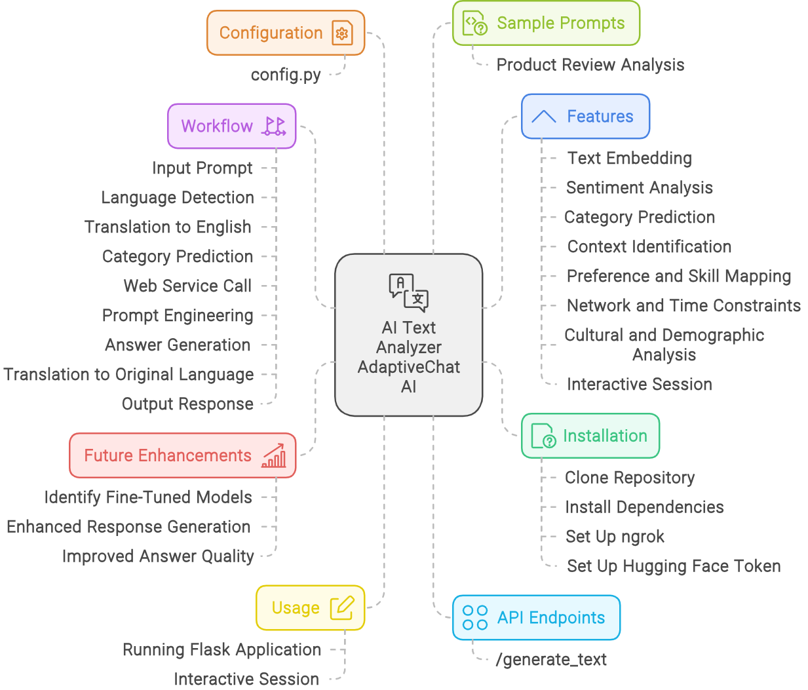
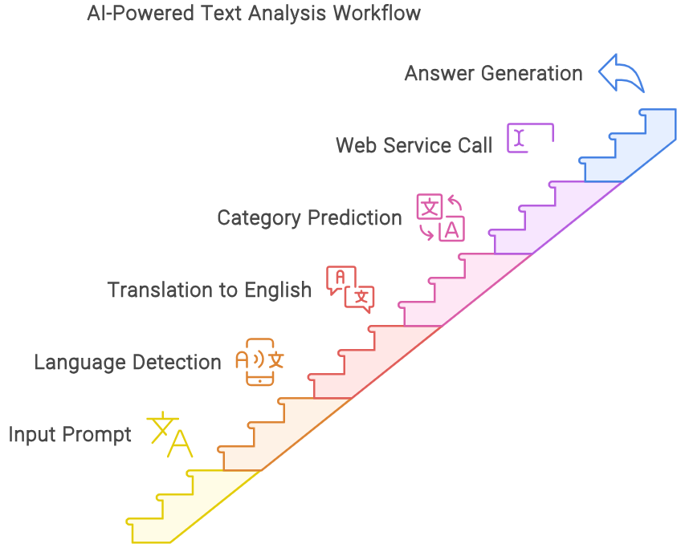

[Return to Panagiotis Bernalis' GitHub Profile for more innovative projects](https://github.com/pbernalis)

# AI Text Analyzer AdaptiveChat AI

A comprehensive AI-powered tool for text analysis, categorization, sentiment analysis, and interactive prompt-response sessions with translation capabilities.

## Table of Contents
- [Overview](#overview)
- [Features](#features)
- [Installation](#installation)
- [Usage](#usage)
- [API Endpoints](#api-endpoints)
- [Configuration](#configuration)
- [Workflow](#workflow)
- [Sample Prompts](#sample-prompts)
- [Future Enhancements](#future-enhancements)
- [Contributing](#contributing)
- [License](#license)

## Overview
This project utilizes models such as the SentenceTransformer for embedding text and sentiment analysis. It is designed to handle a variety of tasks including categorization, sentiment analysis, and identification of specific text characteristics such as tone, learning style, and more.

## Features
- **Text Embedding:** Uses SentenceTransformer to encode text into embeddings.
- **Sentiment Analysis:** Employs for multilingual sentiment analysis.
- **Category Prediction:** Predicts detailed categories based on input text.
- **Context Identification:** Determines the context and experience level from the text.
- **Preference and Skill Mapping:** Maps text to specific preferences and skills.
- **Network and Time Constraints:** Analyzes text for network and time-related constraints.
- **Cultural and Demographic Analysis:** Considers cultural backgrounds and demographics in predictions.
- **Interactive Session:** Allows interactive prompt-response sessions with translation capabilities.

  


## Installation
1. Clone the repository:
    ```bash
    git clone https://github.com/yourusername/AI-Text-Analyzer.git
    cd AI-Text-Analyzer
    ```

2. Install the required dependencies:
    ```bash
    pip install -r requirements.txt
    ```

3. Set up ngrok (optional for local testing):
    ```bash
    ngrok authtoken your-ngrok-auth-token
    ```

4. Set up your Hugging Face token:
    ```bash
    export HF_TOKEN=your-hugging-face-token
    ```

## Usage
### Running the Flask Application
1. Start the Flask application:
    ```bash
    python app.py
    ```

2. The API will be available at the URL provided by ngrok (or `http://127.0.0.1:5000` for local usage).

3. Make a POST request to the `/generate_text` endpoint with the required data.

### Interactive Session
You can start an interactive session that translates prompts from any language to English, processes them, and translates the responses back to the original language.

1. Run the interactive session:
    ```bash
    python interactive_session.py
    ```

2. Follow the prompts in the console to input your text in any language and receive responses from the AI assistant.

## API Endpoints
### `/generate_text`
**Method:** POST

**Description:** Analyzes the provided text and returns predictions based on selected categories.

**Request Body:**
```json
{
  "prompt": "Your text here",
  "categories": ["category", "context", "experience_level", "goal", "sentiment", "tone", "learning_style", "preference", "skill", "education_background", "network", "time_constraint", "motivational_factor", "resource_availability", "current_challenge", "cultural_background", "demographic", "feedback", "availability", "budget_constraint", "health_status", "communication_style", "cognitive_load", "language_proficiency", "specific_interest", "urgency_level"]
}
```

## Configuration
The project relies on a configuration file `config.py` to define various categories, preferences, skills, and other parameters. Ensure that this file is correctly set up with all necessary data.

## Workflow
This section describes the detailed workflow of the AI-powered text analysis tool:

1. **Input Prompt:** The user provides a prompt in any language.
2. **Language Detection:** The tool automatically detects the language of the input prompt.
3. **Translation to English:** The detected language prompt is translated to English using a translation service.
4. **Category Prediction:** The translated English text is processed to predict the top 10 categories out of the 25 predefined categories using SentenceTransformer and cosine similarity.
5. **Web Service Call:** The top 10 predicted categories and the translated prompt are sent to a web service endpoint (`/generate_text`) for further analysis and categorization.
6. **Prompt Engineering:** The tool generates an enhanced prompt by automatically performing prompt engineering based on the identified categories.
7. **Answer Generation:** The enhanced prompt is processed using a language model to generate a detailed response.
8. **Translation to Original Language:** The generated English response is translated back to the original language of the user.
9. **Output Response:** The final translated response is provided to the user in the original input language.

This workflow supports any language, ensuring that every prompt is appropriately translated to English for processing and then back to the original language for the response, providing a seamless experience for users across different languages.




## Sample Prompts

### Sample Prompt 1: Product Review Analysis
**Prompt (in Greek):**
Ποια είναι η σημασία της πολιτιστικής κληρονομιάς για τις μελλοντικές γενιές;


**Workflow:**
- **Language Detection:** Greek
- **Translation to English:** "What is the importance of cultural heritage for future generations?"
- **Category Prediction:** Cultural Analysis, Education, Sociology, Historical Significance.
- **Web Service Call:** The translated prompt and predicted categories are sent to the web service.
- **Prompt Engineering:** Generate an enhanced prompt focusing on Considering the role of cultural heritage in preserving history and identity, how important is it for future generations? Please focus on cultural analysis rather than product or service aspects.
- **Answer Generation:** Detailed suggestions for improving TV sound quality.
- **Translation to Original Language:** Translate the detailed suggestions back to Greek.
- **Output Response (in Greek):** Provide the translated suggestions to the user.

**Response (in Greek):**
1. Η πολιτιστική κληρονομιά παρέχει πληθώρα πληροφοριών για το παρελθόν, το οποίο είναι σημαντικό για το παρόν και το μέλλον.Είναι επίσης ένα εργαλείο που μπορεί να χρησιμοποιηθεί για την καλύτερη κατανόηση της ιστορίας ενός συγκεκριμένου τόπου.
2. Ο σκοπός της διατήρησης των πολιτιστικών χώρων είναι να τους προστατεύσει από βλάβη παρέχοντάς τους προστασία από βανδαλισμό, κλοπή και ζημιές που προκαλούνται από ανθρώπινες δραστηριότητες.Αυτό γίνεται με τον έλεγχο της πρόσβασης, περιορίζοντας την χρονική περίοδο κατά την οποία το ακίνητο είναι ανοικτό σε δημόσια χρήση, διατηρώντας την ακεραιότητα των κτιρίων, προστατεύοντας το φυσικό περιβάλλον, διατηρώντας τους ιστορικούς και πολιτιστικούς πόρους, δημιουργώντας πολιτικές διατήρησης, ανάπτυξη σχεδίων διαχείρισης,Η διεξαγωγή έρευνας, η εκπαίδευση του κοινού, η παρακολούθηση της κατάστασης των ακινήτων, η αξιολόγηση των επιπτώσεων των προγραμμάτων συντήρησης, η επικοινωνία με την κοινότητα κλπ. Ένας πολιτιστικός χώρος ορίζεται ως τόπος όπου οι άνθρωποι έχουν ή ζουν και εργάζονται επί του παρόντος.
 
## Future Enhancements
In the next version of the code, there will be several fine-tuned models based on the predicted categories. The system will:
- **Identify Fine-Tuned Models:** Based on the predicted categories, the system will identify the most appropriate fine-tuned model.
- **Enhanced Response Generation:** The identified fine-tuned model will be used to generate more accurate and contextually appropriate responses.
- **Improved Answer Quality:** This approach will ensure better responses and answers to the prompts, enhancing the overall effectiveness of the tool.

## Contact
For any inquiries or access requests, please reach out via [LinkedIn](https://www.linkedin.com/in/pbernalis/) or email at [pbernalis@gmail.com](mailto:pbernalis@gmail.com).

## License

This project is licensed under the terms specified in this document. For more information, see the [LICENSE](https://github.com/pbernalis/pbernalis/blob/main/blob/main/License.md) file.
