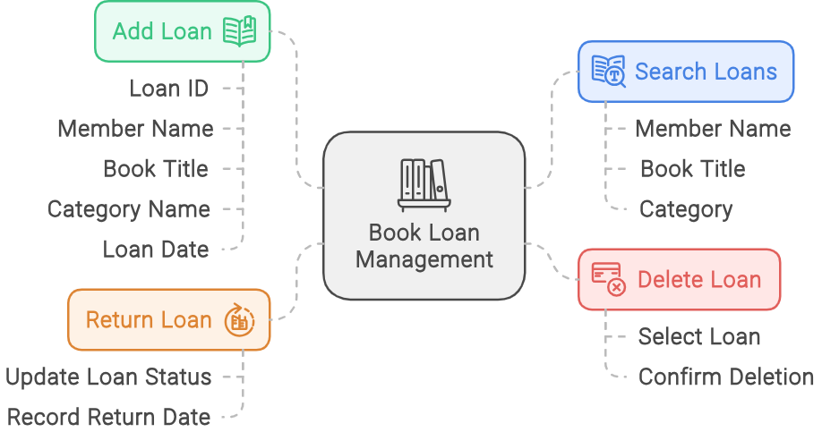

[Return to Panagiotis Bernalis' GitHub Profile for more innovative projects](https://github.com/pbernalis)

# Python Application with Tkinter - Library Management System

## Description
This application is a Library Management System written in Python using Tkinter for the graphical interface. The application offers functionalities such as book viewing, member management, loan management, statistics display, and loan recommendations.


## Prerequisites
Before installing and running the application, ensure you have the following installed:
- **Python 3.9.18:** You can download it from the [official website](https://www.python.org/downloads/release/python-3918/).
- **Tkinter:** Tkinter is usually included in the standard Python installation. If not installed, you can add it via the Python package manager (pip).

## Installation Instructions
1. Download or clone the application code from the GitHub repository [BookLibraryManagementSystem](https://github.com/pbernalis/BookLibraryManagementSystem).
2. Open a terminal or command line and navigate to the folder where the application code is located.
3. (Optional) Create a virtual environment for the application:
    ```sh
    python -m venv myenv
    source myenv/bin/activate   # For Linux/Mac
    myenv\Scripts\activate      # For Windows
    ```
4. Ensure that Tkinter is installed.

## Usage Instructions
1. Open a terminal or command line.
2. Navigate to the folder where the application code is located.
3. Run the application by executing:
    ```sh
    python main.py
    ```
    where `main.py` is the name of the main application file.

## Application Features

### Member Profile Management
Manage member profiles by adding, updating, searching, and deleting members in the library database.
- **Add Member:**
  - Click the "Add Member" button.
  - Fill in the fields with the member's details: Name, Address, Phone, Email, Registration Number, Age, Occupation, Gender.
- **Search Members:**
  - Type the member's name in the search bar and click "Search."
- **Update Member:**
  - Select the member from the list, click "Update Member," modify the details, and click "Update Member."
- **Delete Member:**
  - Select the member from the list, click "Delete Member," and confirm the deletion.

### Member Preferences Management
Manage member loan preferences by setting loan preferences for each library member.
- **Add Preference:**
  - Select the member and book category, enter the preference rating, and click "Add."
- **Update Preference:**
  - Select the preference from the table, update the fields, and click "Update."
- **Delete Preference:**
  - Select the preference from the table and click "Delete."


### Book Management
Manage books by adding, updating, searching, and deleting books in the library database.
- **Add Book:**
  - Click the "Add Book" button.
  - Fill in the fields with the book details: Title, ISBN, Category, Author, Stock.
  - Click the "Add Book" button to save the information in the database.
- **Search Books:**
  - Type the search term in the search bar.
  - Click the "Search" button to view the results in the list.
- **Update Book:**
  - Select a book from the list.
  - Click the "Update Book" button.
  - Modify the details in the window that opens and click "Update" to save the changes.
- **Delete Book:**
  - Select a book from the list.
  - Click the "Delete Book" button.
  - Confirm the deletion when prompted.

### Category Management
Manage categories by adding, updating, and deleting categories in the database.
- **Add Category:**
  - Click the "Add" button.
  - Fill in the field with the category name.
  - Click the "Add" button to save the new category.
- **Update Category:**
  - Select a category from the list.
  - Click the "Update" button.
  - Modify the name in the field and click "Update" to save the changes.
- **Delete Category:**
  - Select a category from the list.
  - Click the "Delete" button.
  - Confirm the deletion when prompted.
 


### Book Loan Management
To manage book loans, select "Loan Management" from the main menu. This will take you to a sub-screen with options for searching, checking availability, loaning, returning, and viewing loan history. The table displays book loans with the following information: Loan ID, Member Name, Book Title, Category Name, Loan Date, Return Date.
- **Search Loans:**
  - Search for loaned books by member name, book title, or category.
- **Add Loan:**
  - Add new book loans to the database.
- **Delete Loan:**
  - Delete existing loans from the database.
- **Return Loan:**
  - Return loaned books and update the database.




### Book Search by Category
The "Book Search by Category" option allows you to view available books by category in your library.
- Select a category from the list on the left panel.
- View the available books in the selected category in the right panel.
This way, you can easily locate books of interest in your library by category.

### Statistics
This tab provides information and queries about the statistics of the library's books and members.
1. **Number of books per member in a specified period:**
   - Displays the number of books borrowed by each member during a specific month and year.
2. **Distribution of borrowing preferences per member:**
   - Shows the categories of books preferred by each member based on their borrowing history.
3. **Books not borrowed in a specified period:**
   - Lists books that were not borrowed during a specific month and year.
4. **Books per category:**
   - Displays the number of books belonging to each category.
5. **Total loans in a specified period:**
   - Shows the total number of loans made during a specific month and year.
6. **Distribution of borrowing preferences in a specified period:**
   - Shows the categories of books most borrowed during a specific month and year.
7. **Borrowing history per member:**
   - Displays the borrowing history for a specific member, including book titles and loan and return dates.
8. **Number of loans per author:**
   - Shows the number of loans for each author.
9. **Number of loans per age group:**
   - Shows the number of loans per age group of members.
10. **Number of loans per gender:**
    - Shows the number of loans per gender of members.
11. **Books with the most loans in a specified period:**
    - Displays the books most borrowed during a specific month and year.
12. **Inactive members:**
    - Lists members who have not borrowed books during a specific month and year.
13. **Books with the highest stock:**
    - Shows the books with the highest stock in the library.
14. **Most active borrowing members:**
    - Displays the members who borrowed the most books during a specific month and year.
15. **Books borrowed but not returned in a specified period:**
    - Lists books that were borrowed and not returned during a specific month and year.
16. **Average loan duration for returned books:**
    - Shows the average loan duration for books that have been returned.
17. **Books per author with the most loans in a specified period:**
    - Displays the authors with the most loans and their book titles during a specific month and year.


### Loan Recommendations
The application can also recommend books to each member based on their borrowing history. When a user selects their name from the list, the program retrieves their preferences from the database. These preferences correspond to ratings the member has given to various book categories, such as science fiction, history, novel, etc. Based on these preferences, the program calculates the category of books that best matches the specific user. This category is the one with the highest preference rating, meaning where the user has given the maximum rating.

The program then selects a random book from this category and returns its title along with the category name. If no books are available in the specific category, the program displays a corresponding message.

Additionally, there is an option to suggest an available book for borrowing, taking into account both the user's preferences and the number of loans for each book. This is done to recommend a book that is both preferred by the user and available for borrowing. The program offers an easy-to-use interface for selecting members and displaying suggestions.


## Contact
For any inquiries or access requests, please reach out via [LinkedIn](https://www.linkedin.com/in/pbernalis/) or email at [pbernalis@gmail.com](mailto:pbernalis@gmail.com).

## License
This project is licensed under the terms specified in this document. For more information, see the [LICENSE](https://github.com/pbernalis/pbernalis/blob/main/blob/main/License.md) file.
