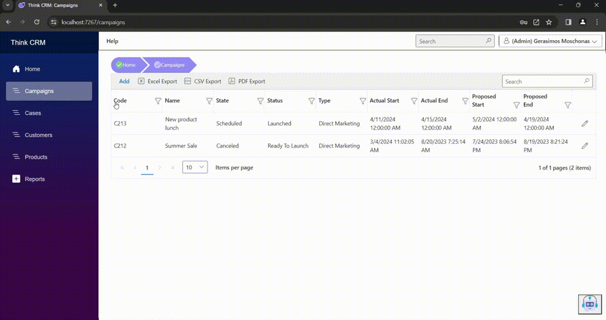
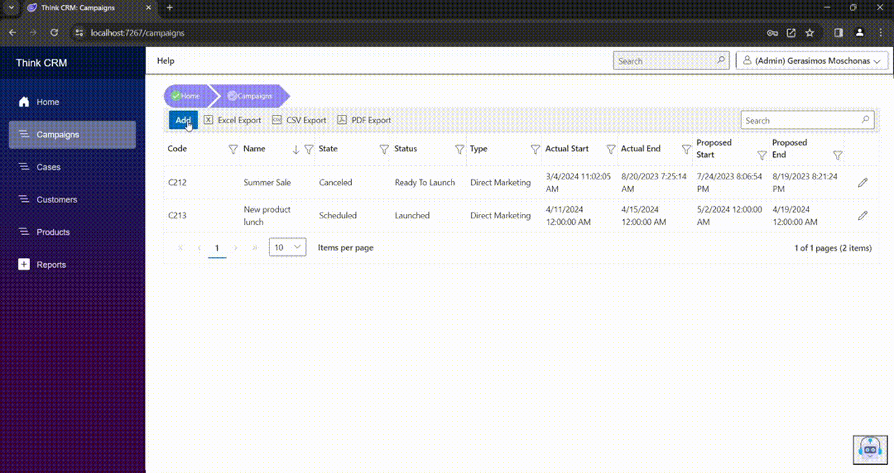
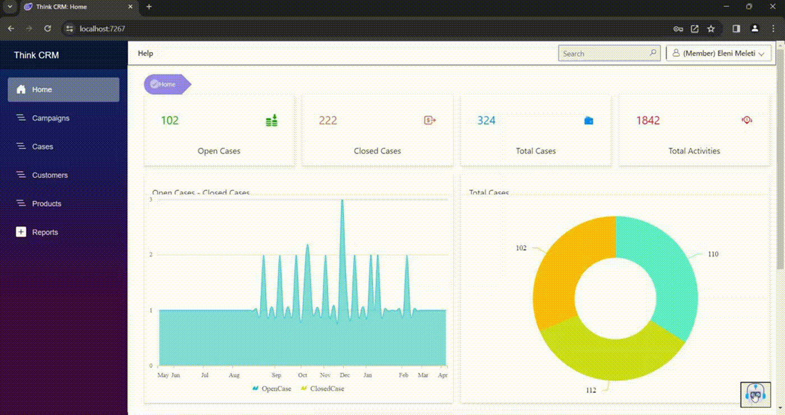
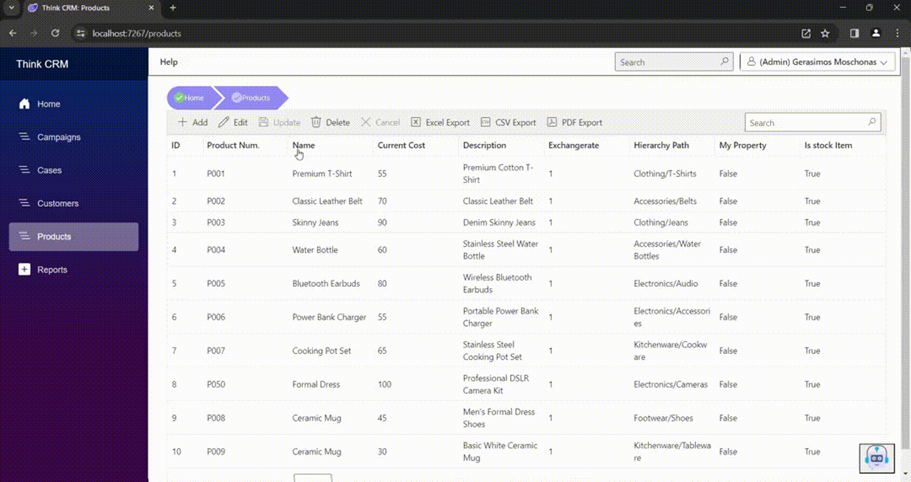
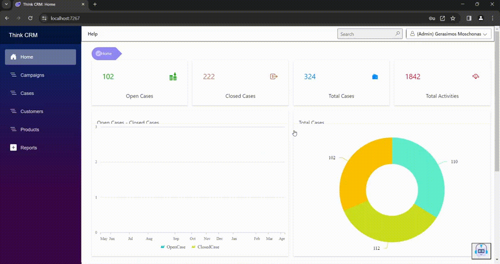
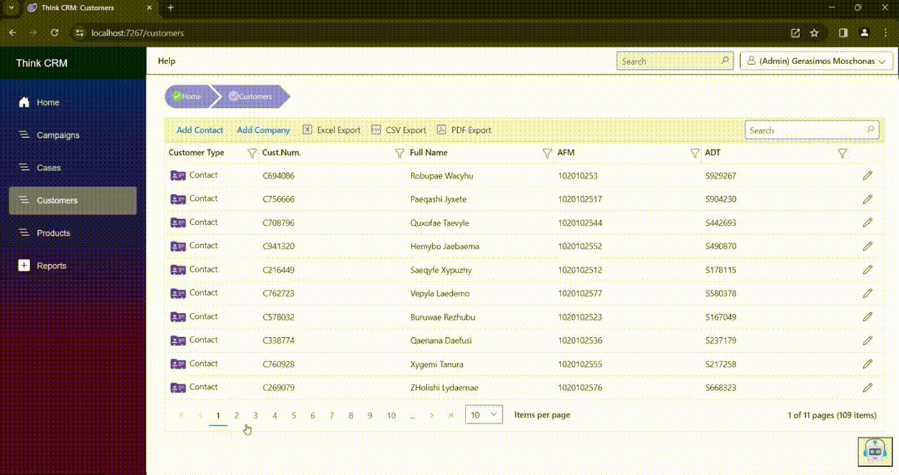
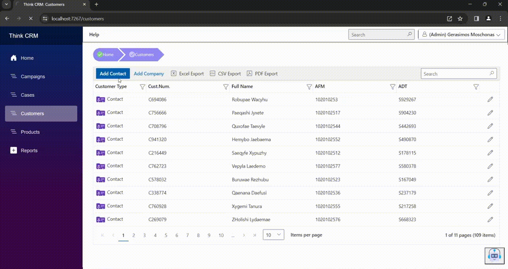
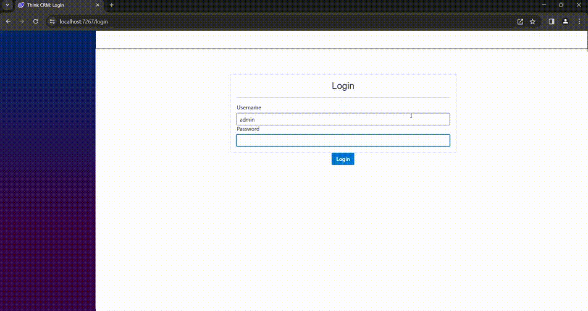

[Return to Panagiotis Bernalis' GitHub Profile for more innovative projects](https://github.com/pbernalis)

# CRM System

## Overview
Developed a Customer Relationship Management (CRM) system, utilizing modern technologies to enhance customer and campaign management.

## Key Features
- **Customer Management:** Manage customer information, communication history, and interactions.
- **Campaign Management:** Execute and track various campaigns for product promotion, updates, and surveys.
- **Chatbot Integration:** AI-driven chatbot using Python and TensorFlow to handle customer queries.
- **Authorization & Security:** Secure API with JWT tokens, user registry, and login mechanisms.

## Technologies Used
- **Backend:** Microsoft .NET Core 8 with Entity Framework Core (Code-First Approach)
- **Frontend:** Blazor with Syncfusion Blazor Controls for dynamic and interactive UI
- **Database:** Microsoft SQL Server for reliable data storage and management
- **AI & Machine Learning:** TensorFlow for AI chatbot implementation
- **API Testing:** Postman for thorough API testing and development

## Tools & Methodologies
- **Development Environment:** Visual Studio 2022 Community Edition
- **Version Control & CI/CD:** Azure DevOps for software lifecycle management
- **Design Patterns:** Repository Pattern and Dependency Injection for modularity and maintainability

## Project Structure
1. **CRM.API:** Backend API project providing secure data interaction.
2. **CRM.Client:** Client-side project built with Blazor for user interface.
3. **CRM.Shared:** Shared library project containing models and business logic.
4. **Python Project:** AI components for chatbot functionality.

## Implementation Highlights
- **Code-First Database Creation:** Automatically created extensive relational database.
- **Chatbot with AI:** Python and TensorFlow-based chatbot integrated into the CRM for automated responses.
- **User Interface:** Syncfusion Blazor Controls used for advanced UI components and better user experience.
- **API Security:** JWT tokens for secure API endpoints.

## Future Extensions
- Enhanced AI capabilities for predictive analysis
- Mobile application development for CRM accessibility
- Integration of advanced reporting and analytics tools

## Benefits & Impact
- **Improved Efficiency:** Automated tasks and optimized workflows.
- **Enhanced Customer Experience:** Personalized and quick responses via AI chatbot.
- **Data Security:** Robust authentication and authorization mechanisms.
- **Scalability:** Easily scalable architecture to accommodate future growth and additional features.

## Screenshots & GIFs

### Login Page

The @page "/login" (login form) for users provides two input fields for Username and Password. The user can enter their credentials and click the "Login" button to log in. If there is an error in the entry, an error message ("Invalid email or password") is displayed. Once the user successfully logs in, the system receives a JWT (JSON Web Token) from an API endpoint provided by the server (API Project). The token is stored locally in the browser (via localStorage). Additionally, information about the logged-in user is retrieved from the server through the CRMUserService. User details such as username, full name, and admin status are stored locally for future use in the application. After a successful login, the user is redirected back to the application's home page. The page also presents some additional stylistic adjustments using CSS to style the form elements.

### Campaigns Page

The @page "/campaigns" is related to campaigns in the system. Specifically, the page includes a grid that displays campaign information such as code, name, status, type, start and end dates, and more. This page also includes a breadcrumb (navigation bar) that allows the user to easily navigate back to the home page. Additionally, there is an add new campaign feature that allows the user to create new campaigns, as well as an edit campaign feature. The grid content can be sorted, filtered, and exported in various formats such as PDF, Excel, or CSV. Users can also edit and delete existing campaigns from the grid. Finally, the page is dynamic and loads campaign data dynamically through calls to the corresponding server-side service.

### Campaign Management Page

The Campaign.razor page is for editing information about a campaign within the CRM application. Some key features include:
1. **Campaign Management:** The page allows the user to manage a campaign, such as code, name, status, type, start and end dates, etc.
2. **Database Interaction:** The page interacts with the database management system to retrieve and store campaign data.
3. **Toolbar Functions:** A toolbar includes icons for functions such as "Save" and "Delete" the campaign.
4. **Data Retrieval:** The page retrieves campaign data from other web services of the application.
5. **User Interaction:** The page also allows user interaction through graphical elements such as text input fields, dropdown lists, and calendars. In general, the page is designed for managing, adding, and editing campaigns within a CRM application.

### Cases Page

The @page "/cases" presents cases related to customer management. The page consists of the following elements:
1. **Navigation Button:** A navigation button labeled "Add" directs the user to another page with the URL "/caseitem" to add a new case.
2. **Breadcrumb:** A breadcrumb allows the user to navigate to previous pages, with specific elements for the home page ("Home") and the current page ("Cases").
3. **Cases Grid:** A grid displays cases related to customer management. Each row corresponds to a case and contains information such as case name, priority, customer name, customer code, customer type, case status, and other relevant details. Icons and editing options are available in each row for managing cases, such as working on the case and editing it.
4. **Toolbar Options:** Toolbar options at the top of the grid include search, export to PDF, Excel, and CSV, record selection per page, and other grid management options. A loading indicator is visible while the grid loads data.

### CaseItem Page

The @page "/caseitem" is an editing page for cases in Think CRM. It provides an editing environment where the user can view, edit, and save data for a specific case.
Page content analysis:
- The page has a breadcrumb navigation element showing the navigation hierarchy in the application. The breadcrumb is configured to provide links to the home page ("Home") and the cases page ("Cases").
- A toolbar contains options for saving and deleting data.
- The page displays various data input fields (such as text, numbers, dates) that allow the user to edit case details. These fields include information like ticket number, title, description, case origin, type, priority, product, etc.
- The page also provides options for selecting customer, contact, campaign, and other relevant information related to the case.
- Various controls allow the user to select and configure options.
- The page includes functions for managing data, such as adding a new case, saving changes, and deleting the case.

### Case Page

The page includes the use of Microsoft's Blazor technology to create interactive web elements. Specifically, the page includes functions such as adding, editing, and deleting customer and case details through a data entry form. It also includes various control elements, such as dropdown lists, grids, and action buttons for managing data.
Various services are used for data management, such as email management, social networks, phone calls, addresses, relative cases, relative customers, chats, collaboration, etc. The page provides the customer's case with all related information, such as other cases they may have and other associations with other customers or companies, as well as the type of association they may have.
In general, the case page allows the user to enter communication results from various channels and view all the customer's information and cases at a glance. Finally, a stepper function is used to display the case's status.

### Chatbot Interaction

The @page "/chat" is a typical chat UI used for communication between a user and an AI system (AssistAI).
1. **Text Input Form:** The user can enter text in the text input field at the bottom of the page.
2. **Dialogue Box:** A dialogue box appears when the user clicks a button. This dialogue box includes messages exchanged between the user and the AI system (AssistAI).
3. **Message List:** Messages appear in a list, where each message consists of the text, sender's name, and a profile image.
4. **Action Buttons:** Action buttons for sending messages and exchanging information with the AI system are available. Web services are used to manage data and interact with the AI system.
The following describes a use case scenario for the CRM chatbot, where the representative records customer comments about movies related to a specific campaign, and the chatbot responds according to the positive or negative reaction. The representative can then take some feedback for the next action.

### Products Page

The @page "/products" is a product page for the CRM (Customer Relationship Management).
1. **Page Title:** Sets the page title as "Think CRM: Products".
2. **Breadcrumb:** A list of categories acts as breadcrumb navigation. The user can navigate to the "Home" and "Products" categories.
3. **Reset Button:** This function is responsible for resetting the buttons.
4. **Loading Spinner:** A loading spinner appears if the products are not yet loaded.
5. **Products Grid:** The main products grid displayed on the page. It includes many columns, such as ID, product number, name, cost, description, exchange rate, and more. The user can perform various actions on the grids, such as adding, editing, deleting, and exporting to various file formats (Excel, CSV, PDF). Various Syncfusion Blazor controls and libraries (such as Buttons, Grids, DropDowns, DataForm, Navigations, Inputs, SplitButtons, Spinner) are used for the development and presentation of the page.

### Home Page

The @page "/home" is written in Blazor, a technology that allows the creation of web applications using C# instead of JavaScript.
1. **Using Declarations:** The page begins with using declarations and integrates various packages and services required for its display and functionality.
2. **Page Title Declaration:** The page title is declared with <PageTitle>.
3. **Null Check Logic:** Logic for checking if CaseSumCodes information is null and displaying a spinner while loading.
4. **Page Content:** If the information is not null, the actual page content is displayed. This includes:
    - A breadcrumb at the top for user navigation.
    - A dashboard layout with information about open, closed, and total cases, as well as total activities.
    - Charts and graphs representing data on cases and activities.
    - A table with recent activities.
The page provides an overview of the CRM system data, possibly for use by administrators or others involved in case and activity management.

### Search Result Page

The @page "/searchresult" displays search results for a specific keyword (SearchText). Initially, the page creates a breadcrumb navigation bar showing the user's current location in the application. Depending on the user's location, they can navigate back to the home page or other relevant pages. Depending on whether search results (searchResults) have been retrieved, either a loading spinner is displayed while the results are loading, or the search results table is shown.
The search results table contains a list of results, which are displayed in columns. The results contain information about the entity (Entity) and the search result text (SearchResultText). When the user clicks on a result, a new page opens with more information about that result. The page also includes CSS code for customizing the appearance of the loading spinner and navigation bar.

### Customers Page

The @page "/customers" presents the customers in the CRM system.
1. **Page Title:** The page title is "Think CRM: Customers".
2. **Breadcrumb:** A breadcrumb displays the user's current location. It consists of three elements: "Home" and "Customers". Users can navigate back to the home page ("Home").
3. **Customers Grid:** A grid displays the customers in the CRM. The grid is configured with columns that include information for each customer, such as customer type, customer number, full name, VAT number, and ID number. Editing options for each record, such as edit, delete, save, and cancel, are also provided.
4. **Toolbar:** A toolbar includes buttons for additional functions, such as adding a new contact and a new company, as well as options for exporting data to PDF, Excel, and CSV. A search button allows users to filter the grid data.
5. **Data Export Options:** Users can export the grid data to PDF, Excel, or CSV for further analysis or storage. The page includes functions related to breadcrumb navigation, editing, and deleting records, and navigating to other CRM pages depending on the customer type (contact or company).

### ContactItem Page

The @page "/contactitem" uses Microsoft's Blazor framework combined with Syncfusion Blazor UI Components. Key features:
1. **Contact Editing Form:** The main area includes a form where the user can edit contact details, such as name, surname, customer type, job role, description, phones, email addresses, social networks, etc.
2. **Customer Options Management:** Various settings allow the user to configure the contact, such as whether to receive emails, faxes, or disable various communication forms.
3. **Tabs for Additional Information:** Tabs allow the user to navigate different categories of contact information, such as phones, addresses, email addresses, social networks, etc.
4. **Customer Type Selection:** The user can choose the contact type between contact and account.
5. **History Management:** Fields display information about who created and modified the contact, along with respective dates.
The page provides a flexible experience for editing contacts in the CRM with various configuration and information display options.
### Company Page

The @page "/company" uses Microsoft's Blazor framework combined with Syncfusion Blazor UI Components. Key features:
1. **Company Editing Form:** The main area includes a form where the user can edit company details, such as name, surname, company type, description, phones, email addresses, social networks, etc.
2. **Company Options Management:** Various settings allow the user to configure the company, such as whether to receive emails, faxes, or disable various communication forms.
3. **Tabs for Additional Information:** Tabs allow the user to navigate different categories of company information, such as phones, addresses, email addresses, social networks, etc.
4. **Company Type Selection:** The user can choose the contact type between contact and account.
5. **History Management:** Fields display information about who created and modified the contact, along with respective dates.
The page provides a flexible experience for editing companies in the CRM with various configuration and information display options.
### Register Page

The @page "/register" handles the registration of new users in the CRM system, available only to users with the Administrator role.
1. **Page Title:** The page title is "Think CRM: Register", indicating the purpose of registering new users in the CRM system.
2. **Registration Form:** A user registration form with fields for username, email, display name, password, and password verification. An option to select whether the user is an admin (Is Admin) is also available; otherwise, the user will have a Member role.
3. **Register Button:** A "Register" button executes the RegisterClick function, which calls the CRMUserService's Register method to register the new user.
4. **User Service Communication:** The built-in ICRMUserService is used for managing user registration functions.
The page offers a registration form for new users, allowing them to create new accounts in the CRM system.
### Help Page

The @page "/help" provides help and FAQs for the Think CRM application, along with video tutorials for getting familiar with its features. A search field is available for quick access to answers to questions. Contact information is provided for any questions or support needed. The sections are styled to create a pleasant browsing experience for users.
## Links & References
- [Microsoft .NET Core Documentation](https://learn.microsoft.com/en-us/dotnet/core/)
- [Blazor Documentation](https://learn.microsoft.com/en-us/aspnet/core/blazor/?view=aspnetcore-8.0)
- [Postman Documentation](https://learning.postman.com/docs/)

## Contact
For any inquiries or access requests, please reach out via [LinkedIn](https://www.linkedin.com/in/pbernalis/) or email at [pbernalis@gmail.com](mailto:pbernalis@gmail.com).

## License

This project is licensed under the terms specified in this document. For more information, see the [LICENSE](https://github.com/pbernalis/pbernalis/blob/main/blob/main/License.md) file.
