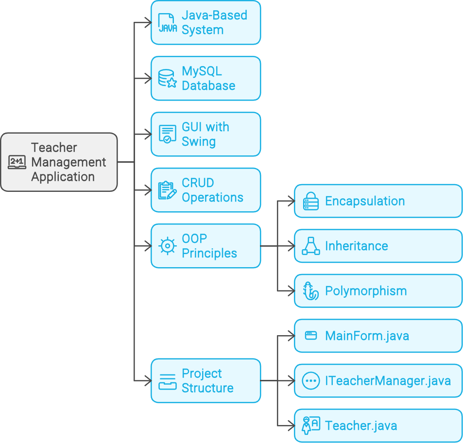
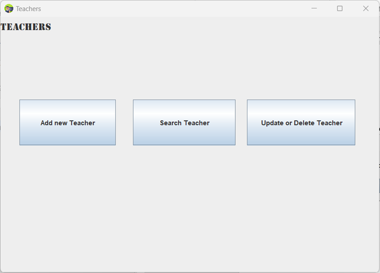
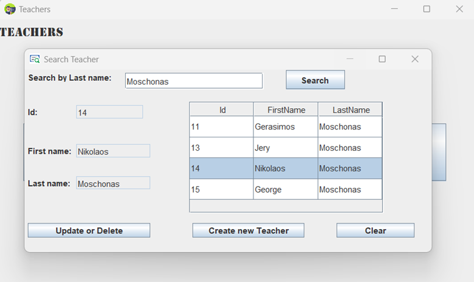
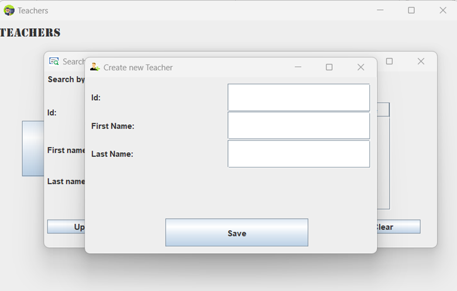
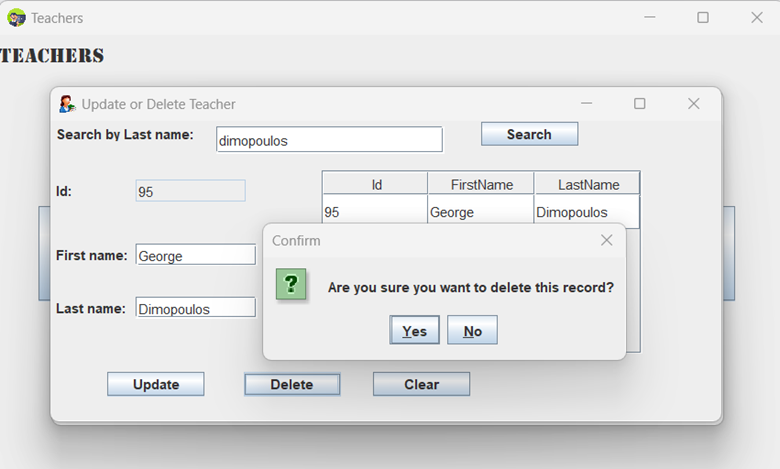

[Return to Panagiotis Bernalis' GitHub Profile for more innovative projects](https://github.com/pbernalis)

# Teacher Management Application
This repository contains a Java-based application developed for the Object-Oriented Programming and Commercial Application Development course. The application is designed to manage teacher records in a MySQL database, showcasing key OOP principles such as inheritance, encapsulation, and polymorphism. The graphical user interface (GUI) built with Swing enables users to create, search, update, and delete teacher records, demonstrating practical applications of OOP concepts.

## Features

- **Add New Teacher**: Create new teacher records.
- **Search Teacher**: Search for teacher records by last name.
- **Update or Delete Teacher**: Update or delete existing teacher records.
- **MySQL Database Connection**: Connect to a MySQL database to perform CRUD operations.

## Object-Oriented Design

The application leverages OOP principles extensively:

- **Encapsulation**: Teacher records are encapsulated within the `Teacher` class.
- **Inheritance**: The application uses inheritance to extend base functionality across different components.
- **Polymorphism**: Interfaces and abstract classes enable polymorphic behavior, allowing for flexible and reusable code.

## Project Structure

The project consists of the following files:

- **MainForm.java**: The main form for the application, providing the user interface for managing teachers.
- **ITeacherManager.java**: An interface defining the operations for managing teacher records, promoting polymorphism.
- **TeacherManager.java**: A class implementing the `ITeacherManager` interface to perform CRUD operations on teacher records.
- **MySQLConnection.java**: A utility class for connecting to the MySQL database.
- **Teacher.java**: A class representing the Teacher entity, demonstrating encapsulation.
- **TeacherCreate.java**: A form for creating new teacher records, inheriting common form behaviors.
- **TeacherSearch.java**: A form for searching teacher records, inheriting common form behaviors.
- **TeacherUpdateDelete.java**: A form for updating or deleting teacher records, inheriting common form behaviors.





## Prerequisites

- Java Development Kit (JDK)
- MySQL Server
- IDE (e.g., Eclipse, IntelliJ IDEA)
- MySQL JDBC Driver

## Setup

1. Clone the repository:
   ```bash
   git clone https://github.com/yourusername/teacher-management-app.git

Import the project into your IDE.

Configure the MySQL connection in MySQLConnection.java:

```java
String url = "jdbc:mysql://localhost:3306/college";
String username = "root";
String password = "yourpassword";
```

Create the necessary database and table:

``` sql
CREATE DATABASE college;
USE college;
CREATE TABLE teachers (
    teacher_id INT PRIMARY KEY AUTO_INCREMENT,
    teacher_fname VARCHAR(50),
    teacher_lname VARCHAR(50)
);
``` 

Run the application by executing MainForm.java.

## Screenshots
### Main Form
The main form connects to the database when it opens for the first time.



### Search Form
The search form allows searching for teachers by last name.



### Create Teacher Form
The form for creating a new teacher.



### Update/Delete Teacher Form
The form for updating or deleting an existing teacher.



## Links & References
- [Java tutorial](https://docs.oracle.com/javase/tutorial/)
- [MySQL Tutorial](https://dev.mysql.com/doc/refman/8.0/en/tutorial.html)


## Contact
For any inquiries or access requests, please reach out via [LinkedIn](https://www.linkedin.com/in/pbernalis/) or email at [pbernalis@gmail.com](mailto:pbernalis@gmail.com).

## License

This project is licensed under the terms specified in this document. For more information, see the [LICENSE](https://github.com/pbernalis/pbernalis/blob/main/blob/main/License.md) file.


