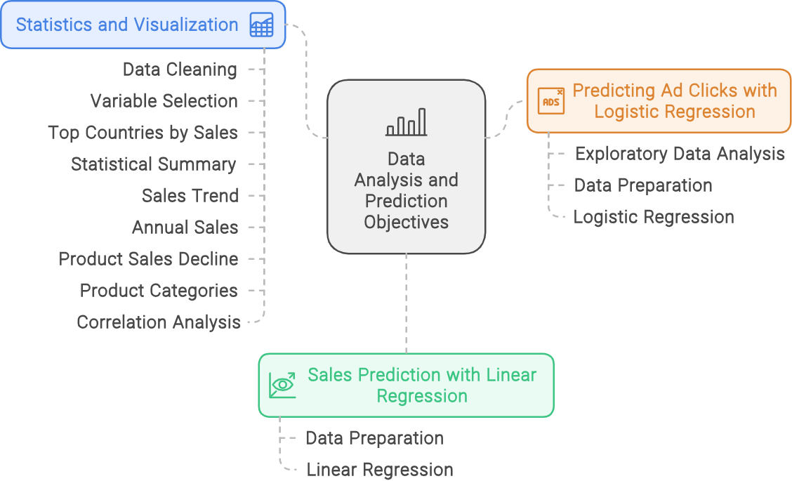
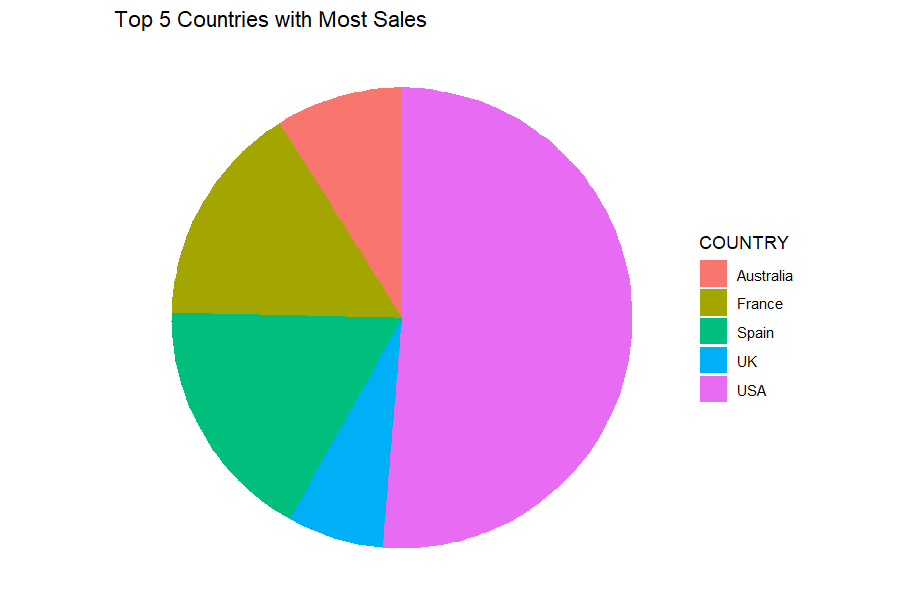
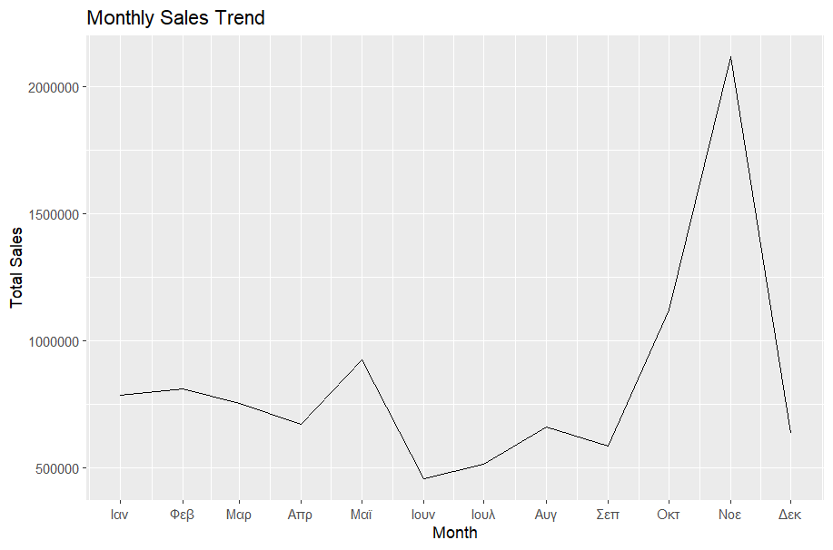
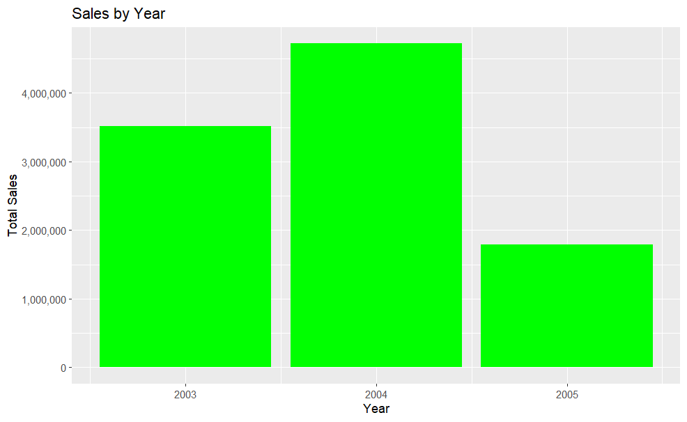
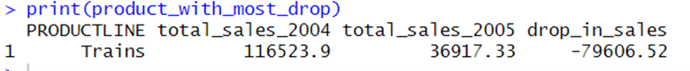
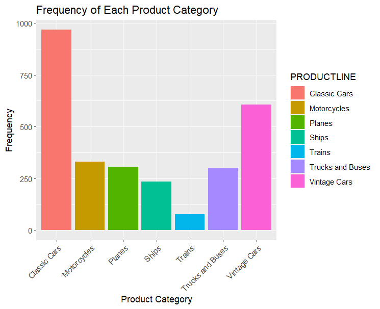
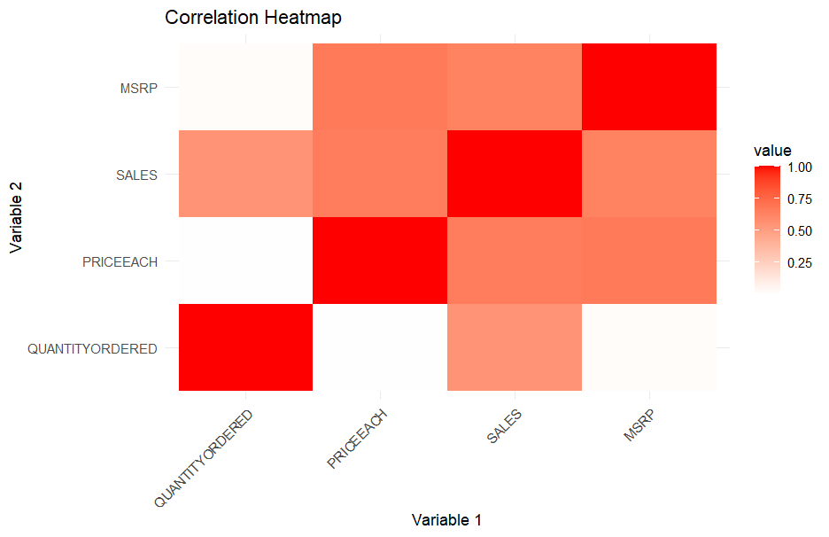
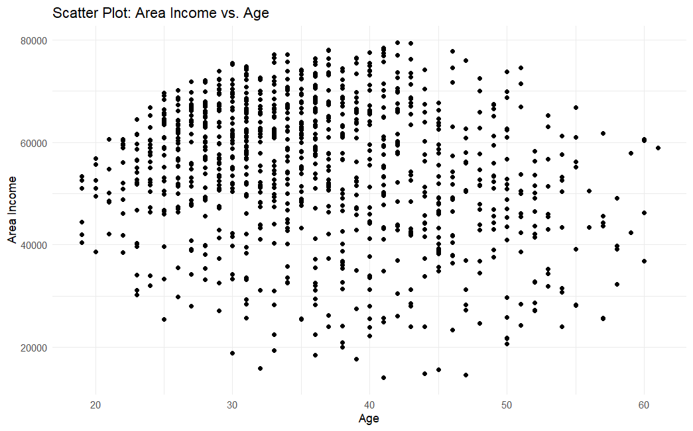
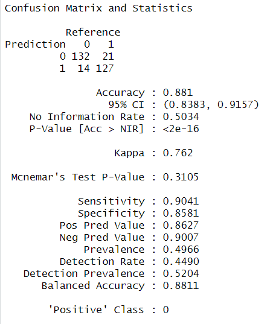

[Return to Panagiotis Bernalis' GitHub Profile for more innovative projects](https://github.com/pbernalis)

# Retail Analytics and Market Analysis Project

## Overview
This project was undertaken as part of a university assignment, aiming to perform a market analysis for a retail analytics company’s largest client, a manufacturing company. The project involves statistical analysis, data visualization, linear regression for sales prediction, and logistic regression to predict user interactions with advertisements.

## Dataset
- **Sales Data**: `data/sales_data_sample.csv` (2.5 years of sales data)
- **Advertising Data**: `data/advertising.csv` (customer interactions data)

### Sales Data Sample
| ORDERNUMBER | QUANTITYORDERED | PRICEEACH | ORDERLINENUMBER | SALES  | ORDERDATE      | STATUS  | QTR_ID | MONTH_ID | YEAR_ID | PRODUCTLINE | MSRP | PRODUCTCODE | CUSTOMERNAME            | PHONE        | ADDRESSLINE1             | ADDRESSLINE2 | CITY        | STATE | POSTALCODE | COUNTRY | TERRITORY | CONTACTLASTNAME | CONTACTFIRSTNAME | DEALSIZE |
|-------------|-----------------|-----------|-----------------|--------|----------------|---------|--------|----------|---------|--------------|------|--------------|-------------------------|--------------|--------------------------|--------------|-------------|-------|------------|---------|-----------|-----------------|------------------|----------|
| 10107       | 30              | 95.7      | 2               | 2871   | 2/24/2003      | Shipped | 1      | 2        | 2003    | Motorcycles  | 95   | S10_1678     | Land of Toys Inc.       | 2125557818   | 897 Long Airport Avenue  |              | NYC         | NY    | 10022      | USA     | NA        | Yu              | Kwai             | Small    |
| 10121       | 34              | 81.35     | 5               | 2765.9 | 5/7/2003       | Shipped | 2      | 5        | 2003    | Motorcycles  | 95   | S10_1678     | Reims Collectables      | 26.47.1555   | 59 rue de l'Abbaye       |              | Reims       |       | 51100      | France  | EMEA      | Henriot         | Paul             | Small    |
| 10134       | 41              | 94.74     | 2               | 3884.34| 7/1/2003       | Shipped | 3      | 7        | 2003    | Motorcycles  | 95   | S10_1678     | Lyon Souveniers         | +33 1 46 62 7555 | 27 rue du Colonel Pierre Avia |        | Paris     |       | 75508      | France  | EMEA      | Da Cunha        | Daniel           | Medium   |
| 10145       | 45              | 83.26     | 6               | 3746.7 | 8/25/2003      | Shipped | 3      | 8        | 2003    | Motorcycles  | 95   | S10_1678     | Toys4GrownUps.com       | 6265557265   | 78934 Hillside Dr.       |              | Pasadena    | CA    | 90003      | USA     | NA        | Young           | Julie            | Medium   |
| 10159       | 49              | 100       | 14              | 5205.27| 10/10/2003     | Shipped | 4      | 10       | 2003    | Motorcycles  | 95   | S10_1678     | Corporate Gift Ideas Co.| 6505551386   | 7734 Strong St.           |              | San Francisco | CA |        | USA     | NA        | Brown           | Julie            | Medium   |

### Advertising Data Sample
| Daily.Time.Spent.on.Site | Age | Area.Income | Daily.Internet.Usage | Ad.Topic.Line | City       | Male | Country  | Timestamp           | Clicked.on.Ad |
|--------------------------|-----|-------------|----------------------|---------------|------------|------|----------|---------------------|---------------|
| 62.93                    | 35  | 128686.91   | 263.41               | Topic A       | Los Angeles| 0    | Canada   | 2022-01-01 00:00:00 | 0             |
| 72.91                    | 47  | 90462.26    | 54.04                | Topic A       | Los Angeles| 1    | Canada   | 2022-01-01 01:00:00 | 1             |
| 66.17                    | 24  | 23562.10    | 163.72               | Topic A       | Chicago    | 1    | Canada   | 2022-01-01 02:00:00 | 0             |
| 62.69                    | 46  | 62896.48    | 138.49               | Topic C       | Los Angeles| 0    | Canada   | 2022-01-01 03:00:00 | 1             |
| 55.42                    | 28  | 96848.51    | 212.25               | Topic B       | New York   | 0    | Australia| 2022-01-01 04:00:00 | 1             |

## Objectives
### Section A: Statistics and Visualization
1. **Data Cleaning**: Check for null values and handle them appropriately.
2. **Variable Selection**: Identify and retain essential variables.
3. **Top Countries by Sales**: Find top 5 countries with the most sales and visualize using bar plots and pie charts.
4. **Statistical Summary**: Compute mean, median, mode, min, and max for `Quantity Ordered` and `Sales`.
5. **Sales Trend**: Identify peak sales periods (months) and visualize the trend.
6. **Annual Sales**: Visualize sales by year and evaluate the performance of the last year (2005).
7. **Product Sales Decline**: Identify the product with the most significant drop in sales in the last year.
8. **Product Categories**: Count different product categories and visualize their frequencies.
9. **Correlation Analysis**: Perform correlation analysis and visualize with a heat map.

### Section B: Sales Prediction with Linear Regression
10. **Data Preparation**: Prepare the dataset for sales prediction.
11. **Linear Regression**: Perform linear regression and evaluate the model using metrics like RMSE and R-square.

### Section C: Predicting Ad Clicks with Logistic Regression
12. **Exploratory Data Analysis**: Scatter plot of Area Income vs. Age to check correlation.
13. **Data Preparation**: Select predictors and target variables for logistic regression.
14. **Logistic Regression**: Train the model, produce a confusion matrix, and evaluate the model’s performance.


## Key Findings and Visualizations

### Top 5 Countries with Most Sales
- **Bar Plot**: 
  
- **Pie Chart**: 
  

### Statistical Summary

#### Quantity Ordered:
- **Mean**: 35.96
- **Median**: 35
- **Mode**: 30
- **Min**: 6
- **Max**: 100

#### Sales:
- **Mean**: 4208.33
- **Median**: 4109.53
- **Mode**: 5079.19
- **Min**: 482.13
- **Max**: 14053.88


### Peak Sales Periods
- **Sales Trend**: 
  

### Annual Sales
- **Bar Plot**: 
  

### Product with Most Drop in Sales
- **Product Sales Decline**: 
  

### Product Categories Frequency
- **Bar Plot**: 
  

### Correlation Analysis
- **Heatmap**: 
  

### Scatter Plot of Area Income vs. Age
- **Scatter Plot**: 
  

### Logistic Regression Results
- **Confusion Matrix**: 
  

The confusion matrix generated from the logistic regression model evaluates its performance in predicting whether users will click on an advertisement or not.

- **True Positives (TP)**: 132 cases. Actual users correctly predicted to click.
- **True Negatives (TN)**: 127 cases. Actual users correctly predicted not to click.
- **False Positives (FP)**: 21 cases. Users incorrectly predicted to click.
- **False Negatives (FN)**: 14 cases. Users incorrectly predicted not to click.

Performance evaluation:
- **Accuracy**: 0.881. The model has high accuracy in its predictions.
- **Sensitivity**: 0.9041. The model effectively detects actual users who will click.
- **Specificity**: 0.8581. The model moderately detects users who will not click.

The results indicate that the model performs well in predicting user behavior but can improve in minimizing false predictions.


## Tools and Libraries
- R
  - `tidyverse`
  - `scales`
  - `ggplot2`
  - `reshape2`
  - `dplyr`
  - `caTools`
  - `caret`

## How to Run the Code
1. Clone the repository:
    ```bash
    git clone [https://github.com/pbernalis/Market-Analysis-R.git]
    cd arket-Analysis-R
    ```

2. Set the working directory in your R environment to the project directory:
    ```r
    setwd("path/to/arket-Analysis-R")
    ```

3. Install the required libraries if not already installed:
    ```r
    install.packages(c("tidyverse", "scales", "ggplot2", "reshape2", "dplyr", "caTools", "caret"))
    ```

4. Load and run the analysis script:
    ```r
    source("analysis.R")
    ```

## Conclusion
This project demonstrates comprehensive data analysis, visualization, and predictive modeling skills using R. The insights derived and the predictive models built can significantly aid in targeted marketing and sales forecasting.

## Contact
For any inquiries or access requests, please reach out via [LinkedIn](https://www.linkedin.com/in/pbernalis/) or email at [pbernalis@gmail.com](mailto:pbernalis@gmail.com).

## License

This project is licensed under the terms specified in this document. For more information, see the [LICENSE](https://github.com/pbernalis/pbernalis/blob/main/blob/main/License.md) file.
