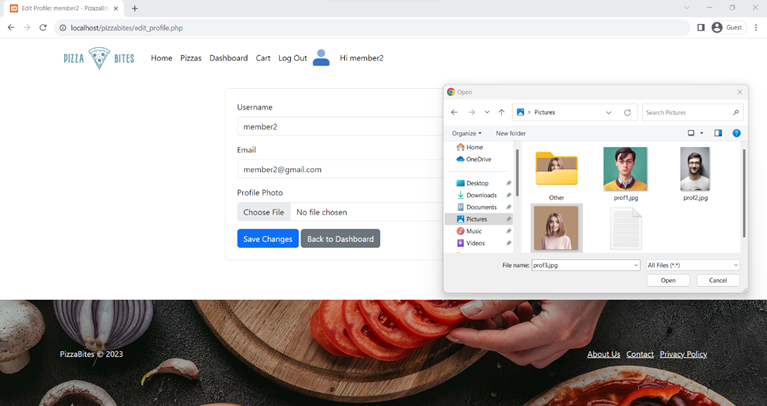

[Return to Panagiotis Bernalis' GitHub Profile for more innovative projects](https://github.com/pbernalis)

# PizzaBites E-commerce Application


## Table of Contents
- [Section A: Reasons for Using PHP in the E-commerce Web Application](#section-a-reasons-for-using-php-in-the-e-commerce-web-application)
- [Section B: Implementation of E-commerce Pages](#section-b-implementation-of-e-commerce-pages)
- [Section C: Shopping Cart](#section-c-shopping-cart)
- [PHP Pages Detailed](#php-pages-detailed)
  - [header.php](#headerphp)
  - [footer.php](#footerphp)
  - [aboutus.php](#aboutusphp)
  - [add_product.php](#add_productphp)
  - [edit_product.php](#edit_productphp)
  - [delete_product.php](#delete_productphp)
  - [db_connection.php](#db_connectionphp)
  - [error.php](#errorphp)
  - [style.css](#stylecss)
  - [contact.php](#contactphp)
  - [privacy.php](#privacyphp)
  - [index.php](#indexphp)
  - [register.php](#registerphp)
  - [login.php](#loginphp)
  - [dashboard.php](#dashboardphp)
  - [edit_profile.php](#edit_profilephp)
  - [product_list.php](#product_listphp)
  - [cart.php](#cartphp)
  - [checkout.php](#checkoutphp)
  - [order_confirmation.php](#order_confirmationphp)
  - [thank_you.php](#thank_youphp)
- [Database](#database)
  - [Tables](#tables)
- [Host Files](#host-files)
- [PHP Code](#php-code)
- [Links & References](#links--references)
- [Contact](#contact)

## Section A: Reasons for Using PHP in the E-commerce Web Application

For this project, PHP is used for several reasons related to the capabilities and requirements of the e-commerce web application:
- PHP has excellent support for database interaction, especially with MySQL, which we will use in this case. This allows us to efficiently store and manage customer, product, and order data.
- PHP offers libraries and tools for data processing, such as encoding, decoding, text processing, etc.
- PHP is a programming language with support for dynamic content generation. We can create dynamic pages that produce different content for each customer, such as personalized welcome messages and product content.
- PHP provides various security measures to protect our code and data.
PHP will help manage the database, create dynamic pages, allow user interaction, and provide a secure environment for our customers.

## Section B: Implementation of E-commerce Pages

- The homepage includes the logo and company presentation, as well as a brief presentation of the products for sale. It manages product data from the database and dynamically presents their information.
- An input form is implemented where the customer must enter their account details. This information is verified in the database. If the information is correct, the homepage loads with a personalized welcome message and some additional information discussed below.
- The information entered in the customer registration form will be stored in the database to create a new account. After successfully completing the process, the same personalized welcome message will be displayed.

## Section C: Shopping Cart

Customers can add products to the cart while browsing. The products are stored in the $_SESSION variable. Various functions are supported, such as deleting products, changing quantities, and calculating the total cost.
Additional pages were implemented for product management, etc., in the online pizza sales store.

## PHP Pages Detailed

### header.php
- Starts with `session_start()` to use $_SESSION variables for user information.
- Checks if the URL's QUERY_STRING parameter is 'noname' and deletes Session variables related to the username to log out.
- Sets the $name variable to $_SESSION['username'], or 'Guest'.
- Sets the $image variable to $_SESSION['profilephoto'], or 'profile_photos/Guest.png'.
- Sets the $role_id variable to $_SESSION['role_id'], or '0'.
- Includes CSS and JavaScript (including Bootstrap) in the <head> section for website design.
- Creates a navigation bar based on the user's connection and role (e.g., admin).
  
#### Role Admin


#### Role Member


#### Role Guest


### footer.php
- Checks if the user accepted the cookies via the "Ok" button and the "cookiesAccepted" cookie.
- If the user has not accepted the cookies, a banner for acceptance with a message and "Ok" button is displayed.
- When the "Ok" button is pressed, the "cookiesAccepted" cookie is created with the value "true" valid for 30 days.
- Includes links to "About Us", "Contact", and "Privacy Policy".
- Uses an image as a background from the file `images/footerbackground.jpg`.


### aboutus.php
Contains information about the website and the "PizzaBites" company.


### add_product.php
Describes the "Add Pizza" page. Admins can add a new pizza to the database with specific attributes such as name, price, description, and product image.


### edit_product.php
Allows the admin to edit product information and update the database with the new information. Initially, the code checks if the logged-in user is an admin using the `is_admin($roleid)` function. Then, it checks if a "product_id" exists in the URL and loads the product data from the database.


### delete_product.php
Checks if the logged-in user is an admin using the `is_admin($roleid)` function. Then, it checks if a "product_id" exists in the URL and loads the product data from the database. Displays a confirmation message for product deletion with options to confirm or cancel the deletion. If confirmed, the product is deleted from the database.


### db_connection.php
Contains the code for connecting to the MySQL database. Specifically:
1. Assigns the variables $host, $dbname, $username, and $password with the database connection information.
2. Creates the database connection using PHP Data Object (PDO).
3. If an error occurs during the connection, the code catches the PDOException and displays an error message.

### error.php
Used to display an error message to the user when trying to access a page they do not have permission for.


### style.css
Contains custom styles for the pizza eCommerce app.

### contact.php
The "Contact" page of the "PizzaBites" website. Users can get in touch using the contact form. The entered data (such as name, email, message) is inserted into the database before redirecting the user to (thank_you.php). Also, an embedded Google map is added to show the business location.


### privacy.php
Presents the website's Privacy Policy.


### index.php
The homepage of PizzaBites presents "Featured Products" from the database. There is a link to the "product_list.php" page for all products. On the right, there are two cards for "Contact Us" and "About Us" with links to "contact.php" and "aboutus.php" respectively.

#### Role Admin

#### Role Member

#### Role Guest


### register.php
The user registration page for the PizzaBites e-commerce store. The registration form is presented and submitted by the user. The password is hashed for security reasons using the `password_hash` function.


### login.php
Allows users to log into the store by entering their username and password. If the information is valid, it is stored in the $_SESSION variables, and the user is redirected to the dashboard.php page, otherwise, an error message is displayed. The password is hashed for security reasons using the `password_verify` function.


### dashboard.php
Describes the "Dashboard" page of the "PizzaBites" website. Users can see their profile information (Welcome message) and order history. Checks if the user is logged in using the $_SESSION["user_id"] variable. If not logged in, it redirects to the login.php page using the `header("Location: login.php")` function, and execution stops with the `exit` command.


### edit_profile.php
Allows users to edit their profile. They can change the username, email, and password and save the changes to the database.




### product_list.php
Displays all available products with photos, descriptions, and prices. Users can add, edit, or delete products in the cart. Admins have "Edit" and "Delete" buttons for each product, redirecting to "edit_product.php" and "delete_product.php" with the product_id in the URL.
#### Role Member


#### Role Admin


#### Role Guest


### cart.php
Displays the user's shopping cart contents. Users can see all products added to the cart, edit product quantities, and proceed to checkout. It shows the products in a table with fields like product name, quantity, price, total, and a "Remove" option to remove a product from the cart. Calculates the total cost of the products in the cart. If the cart is not empty, buttons to proceed to checkout (checkout.php) or add more products (product_list.php) are displayed. If the cart is empty, a message indicating the cart is empty is displayed.


### checkout.php
Responsible for completing the order. Users could enter payment and shipping information before completing their order. Calculates the total order amount and stores it in the $total_amount variable. Inserts the order details into the "orders" table and retrieves the order number using the `lastInsertId()` method. For each product in the cart, inserts its details into the "order_items" table. If the process completes successfully, the transaction is committed and the cart is cleared (unset) after successful payment. Displays the checkout form containing the cart details and total amount. The user can submit the order by clicking the "Place Order" button. If the cart is empty, a message indicating the cart is empty is displayed.


### order_confirmation.php
Responsible for order confirmation and displaying related information. Checks if the user is logged in. If not, it redirects the user to the login.php page. The file checks the URL parameter `order_id` to retrieve the order details from the database. The order number is obtained from the URL and stored in the $order_id variable. If the order number is set, a confirmation message (Thank you for your purchase!) is displayed along with the order number and products, quantities, total price, etc. If the order number is not set, an error message (Invalid order ID.) is displayed. The order_confirmation.php file is the final step in the checkout process, confirming to the user that their order has been successfully completed.


### thank_you.php
This page is used to confirm that the contact form has been successfully submitted.


## Database (MySQL)

### Tables
- **contact_submissions**:
  - Fields: id, name, email, message, submitted_at
  - Data: Stores user contact submissions.
- **orders**:
  - Fields: order_id, user_id, total_amount, order_date, status
  - Data: Stores order details.
- **order_items**:
  - Fields: order_item_id, order_id, product_id, quantity, price
  - Data: Stores items in each order.
- **products**:
  - Fields: product_id, name, description, price, image
  - Data: Stores product details.
- **users**:
  - Fields: user_id, username, email, password, role_id
  - Data: Stores user details.
    
### Database Diagram   


## Host Files
Contains necessary files for hosting the application.

## PHP Code
Contains all PHP code for the e-commerce application.

### Code Samples
Here are some code samples from various files in the project:
#### header.php

```php
<?php
session_start();
$name = isset($_SESSION['username']) ? $_SESSION['username'] : 'Guest';
$image = isset($_SESSION['profilephoto']) ? $_SESSION['profilephoto'] : 'profile_photos/Guest.png';
$role_id = isset($_SESSION['role_id']) ? $_SESSION['role_id'] : '0';
?>
<!DOCTYPE html>
<html lang="en">
<head>
    <meta charset="UTF-8">
    <title>PizzaBites</title>
    <link rel="stylesheet" href="style.css">
    <script src="https://code.jquery.com/jquery-3.6.0.min.js"></script>
    <script src="https://maxcdn.bootstrapcdn.com/bootstrap/3.4.1/js/bootstrap.min.js"></script>
</head>
<body>
<nav class="navbar navbar-default">
    <div class="container-fluid">
        <div class="navbar-header">
            <a class="navbar-brand" href="index.php">PizzaBites</a>
        </div>
        <ul class="nav navbar-nav">
            <li><a href="index.php">Home</a></li>
            <li><a href="product_list.php">Products</a></li>
            <li><a href="cart.php">Cart</a></li>
            <?php if ($role_id == 1) : ?>
                <li><a href="add_product.php">Add Product</a></li>
            <?php endif; ?>
            <li><a href="aboutus.php">About Us</a></li>
            <li><a href="contact.php">Contact</a></li>
        </ul>
        <ul class="nav navbar-nav navbar-right">
            <?php if ($name == 'Guest') : ?>
                <li><a href="login.php"><span class="glyphicon glyphicon-log-in"></span> Login</a></li>
                <li><a href="register.php"><span class="glyphicon glyphicon-user"></span> Register</a></li>
            <?php else : ?>
                <li class="dropdown">
                    <a class="dropdown-toggle" data-toggle="dropdown" href="#">
                        " class="profile-img"> <?php echo $name; ?>
                        <span class="caret"></span>
                    </a>
                    <ul class="dropdown-menu">
                        <li><a href="dashboard.php">Dashboard</a></li>
                        <li><a href="edit_profile.php">Edit Profile</a></li>
                        <li><a href="logout.php">Logout</a></li>
                    </ul>
                </li>
            <?php endif; ?>
        </ul>
    </div>
</nav>
```

#### footer.php

```php
<?php if (!isset($_COOKIE['cookiesAccepted'])) : ?>
    <div class="cookie-banner">
        <p>This website uses cookies to ensure you get the best experience on our website. <button id="acceptCookies" class="btn btn-primary">Ok</button></p>
    </div>
    <script>
        document.getElementById('acceptCookies').addEventListener('click', function () {
            document.cookie = "cookiesAccepted=true; max-age=" + 30 * 24 * 60 * 60 + "; path=/";
            document.querySelector('.cookie-banner').style.display = 'none';
        });
    </script>
<?php endif; ?>
<footer>
    <div class="container">
        <p>&copy; 2024 PizzaBites. All Rights Reserved.</p>
        <ul class="footer-links">
            <li><a href="aboutus.php">About Us</a></li>
            <li><a href="contact.php">Contact</a></li>
            <li><a href="privacy.php">Privacy Policy</a></li>
        </ul>
    </div>
    
</footer>
```

#### add_product.php

```php
<?php
session_start();
include('db_connection.php');

if ($_SESSION['role_id'] != 1) {
    header('Location: error.php');
    exit();
}

if ($_SERVER['REQUEST_METHOD'] == 'POST') {
    $name = $_POST['name'];
    $description = $_POST['description'];
    $price = $_POST['price'];
    $image = $_FILES['image']['name'];
    $target = "images/".basename($image);

    $sql = "INSERT INTO products (name, description, price, image) VALUES (?, ?, ?, ?)";
    $stmt = $pdo->prepare($sql);
    $stmt->execute([$name, $description, $price, $image]);

    if (move_uploaded_file($_FILES['image']['tmp_name'], $target)) {
        header('Location: product_list.php');
        exit();
    } else {
        echo "Failed to upload image";
    }
}
?>
<!DOCTYPE html>
<html lang="en">
<head>
    <meta charset="UTF-8">
    <title>Add Product</title>
    <link rel="stylesheet" href="style.css">
</head>
<body>
    <h1>Add New Pizza</h1>
    <form action="add_product.php" method="post" enctype="multipart/form-data">
        <label for="name">Name:</label>
        <input type="text" name="name" required>
        <label for="description">Description:</label>
        <textarea name="description" required></textarea>
        <label for="price">Price:</label>
        <input type="text" name="price" required>
        <label for="image">Image:</label>
        <input type="file" name="image" required>
        <button type="submit">Add Pizza</button>
    </form>
</body>
</html>
```


## Links & References
- [PHP Documentation](https://www.php.net/docs.php)
- [MySQL Documentation](https://dev.mysql.com/doc/)
- [Bootstrap Documentation](https://getbootstrap.com/docs/4.1/getting-started/introduction/)

## Contact
For any inquiries or access requests, please reach out via [LinkedIn](https://www.linkedin.com/in/pbernalis/) or email at [pbernalis@gmail.com](mailto:pbernalis@gmail.com).

## License

This project is licensed under the terms specified in this document. For more information, see the [LICENSE](https://github.com/pbernalis/pbernalis/blob/main/blob/main/License.md) file.
