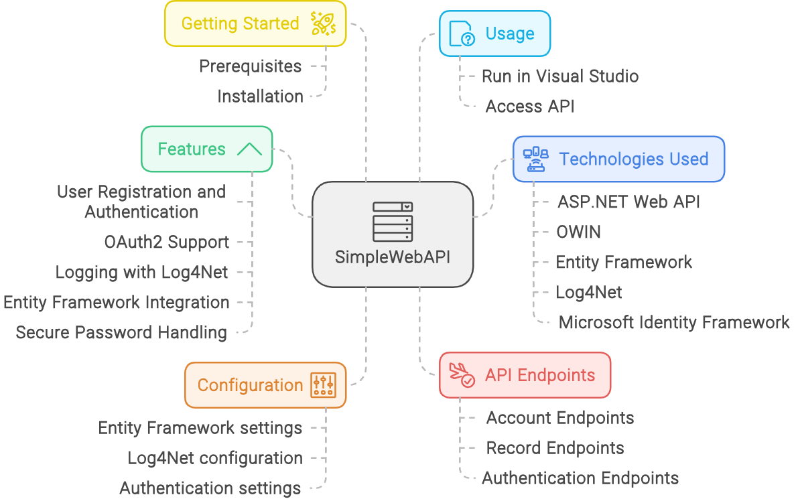
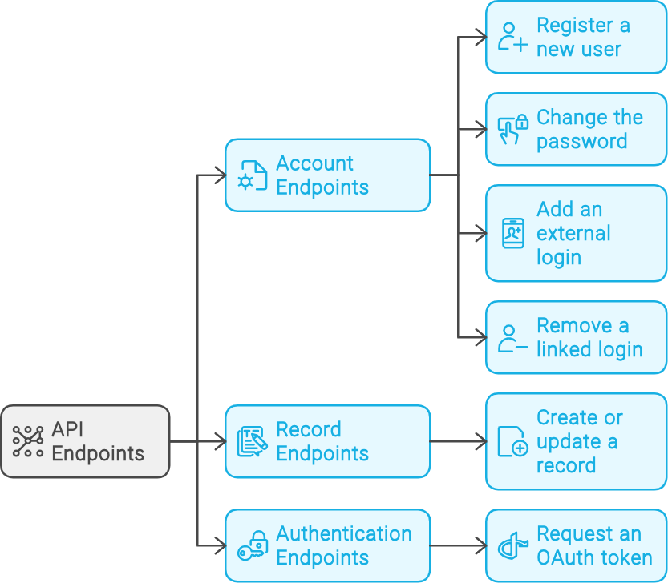

[Return to Panagiotis Bernalis' GitHub Profile for more innovative projects](https://github.com/pbernalis)

# SimpleWebAPI

This is a sample Web API project built using ASP.NET and OWIN, implementing user authentication and logging functionalities. The project is designed to manage user accounts, handle authentication, and log user activities.




## Table of Contents

- [Features](#features)
- [Technologies Used](#technologies-used)
- [Getting Started](#getting-started)
  - [Prerequisites](#prerequisites)
  - [Installation](#installation)
- [Configuration](#configuration)
- [Usage](#usage)
- [API Endpoints](#api-endpoints)
- [Contributing](#contributing)
- [License](#license)

## Features

- User Registration and Authentication
- OAuth2 Support
- Logging with Log4Net
- Entity Framework Integration
- Secure Password Handling

## Technologies Used

- ASP.NET Web API
- OWIN (Open Web Interface for .NET)
- Entity Framework
- Log4Net
- Microsoft Identity Framework

## Getting Started

### Prerequisites

- .NET Framework 4.5.2 or higher
- SQL Server

### Installation

1. Clone the repository:
   ```bash
   git clone https://github.com/pbernalis/SimpleWebAPI.git
   ```

2. Navigate to the project directory:
   ```bash
   cd SimpleWebAPI
   ```

3. Restore the NuGet packages:
   ```bash
   nuget restore
   ```

4. Build the project:
   ```bash
   msbuild
   ```

5. Update the database connection strings in `Web.config`:
   ```xml
   <connectionStrings>
     <add name="ApiConnection" connectionString="your_connection_string" providerName="System.Data.SqlClient" />
   </connectionStrings>
   ```

## Configuration

The `Web.config` file contains various configuration settings, including:

- Entity Framework settings
- Log4Net configuration
- Authentication settings

Ensure that you update the connection strings and any other relevant settings for your environment.

## Usage

To run the application:

1. Open the project in Visual Studio.
2. Press `F5` to start debugging, or `Ctrl + F5` to run without debugging.

The API will be accessible at `http://localhost:portnumber`.

## API Endpoints

### Account Endpoints

- `POST /api/Account/Register` - Register a new user
- `POST /api/Account/ChangePassword` - Change the password for a logged-in user
- `POST /api/Account/AddExternalLogin` - Add an external login (e.g., Google, Facebook)
- `POST /api/Account/RemoveLogin` - Remove a linked login

### Record Endpoints

- `POST /api/Record` - Create or update a record

### Authentication Endpoints

- `POST /Token` - Request an OAuth token




## Contact
For any inquiries or access requests, please reach out via [LinkedIn](https://www.linkedin.com/in/pbernalis/) or email at [pbernalis@gmail.com](mailto:pbernalis@gmail.com).

## License
This project is licensed under the terms specified in this document. For more information, see the [LICENSE](https://github.com/pbernalis/pbernalis/blob/main/blob/main/License.md) file.


