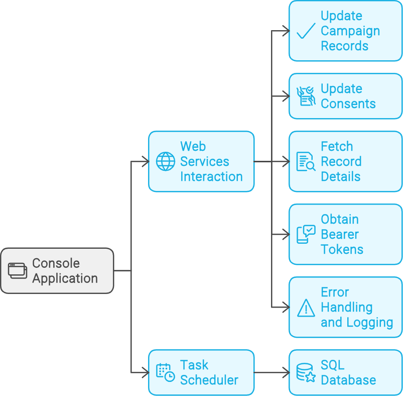
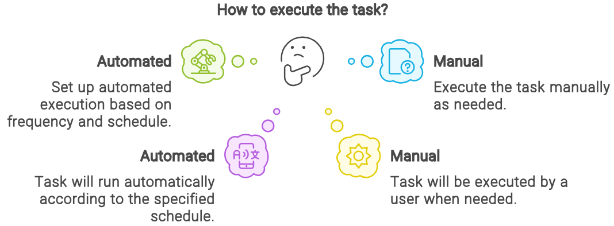

[Return to Panagiotis Bernalis' GitHub Profile for more innovative projects](https://github.com/pbernalis)

# Web Service Console Application

This console application interacts with various web services to manage user data, update user preferences, and retrieve user details. The application is built using C# and .NET, with logging provided by log4net and configuration managed through `App.config`. Additionally, it includes a scheduler task that runs with Windows Task Scheduler to check schedules from a SQL database table.


## Features

- Update user status
- Manage user preferences
- Fetch and process user details
- Obtain authentication tokens
- Robust error handling and logging
- Task scheduling with Windows Task Scheduler
  


## Table of Contents

- [Prerequisites](#prerequisites)
- [Configuration](#configuration)
- [Usage](#usage)
- [Project Structure](#project-structure)
- [Core Classes and Methods](#core-classes-and-methods)
- [Logging](#logging)
- [Error Handling](#error-handling)
- [Database Procedures](#database-procedures)
- [Task Scheduler](#task-scheduler)
- [Email Notifications](#email-notifications)
- [Contributing](#contributing)
- [License](#license)
- [Contact](#contact)

## Prerequisites

- .NET Framework 4.7.2 or later
- SQL Server for database operations
- Visual Studio 2019 or later (recommended for development)


## Configuration

The application configuration is managed through the `App.config` file. Update the following settings based on your environment:

```xml
<configuration>
  <appSettings>
    <add key="baseUrl" value="your_api_baseUrl/"/>
    <add key="UpdatePreferencesUrl" value="your_api_UpdatePreferencesUrl"/>
    <add key="UpdatePreferencesUrlOnline" value="your_api_UpdatePreferencesUrlOnline"/>
    <add key="APIusername" value="your_api_username"/>
    <add key="APIpassword" value="your_api_password"/>
    <add key="APIpasswordOnline" value="your_api_password_online"/>
    <add key="Proxy" value="your_proxy_address"/>
    <add key="chunkSize" value="100"/>
    <add key="AuthorizationHeader" value="your_authorization_header"/>
    <add key="TokenPreferencesUrl" value="your_token_preferences_url"/>
  </appSettings>
  <connectionStrings>
    <add name="DefaultConnection" connectionString="your_connection_string" providerName="System.Data.SqlClient"/>
  </connectionStrings>
</configuration>
```

## Usage
1. Clone the repository:
```sh
git clone https://github.com/pbernalis/WebServiceConsole.git
```
2. Open the project in Visual Studio.
3. Restore the NuGet packages.
4. Update the App.config file with your settings.
5. Build and run the project.
   
The main entry point of the application is the Main method in Program.cs. The application logs its progress and errors using log4net.

## Project Structure
- Program.cs (General): Main entry point of the general API interaction solution.
- Program.cs (Online): Main entry point of the online API interaction solution.
- clsAPI.cs: Contains the core logic for interacting with  web services.
- clsUtils.cs: Utility class for logging errors to the database.
- App.config: Configuration file for the application.
- ApiCaller.cs: Handles obtaining bearer tokens for authentication (Realtime solution).


## Core Classes and Methods
### General Solution

#### Program.cs (General)
- Main(): The main entry point of the application. Initializes logging, reads configuration, and starts the main process.

#### clsAPI.cs
- clsAPI: Constructor to initialize API settings and database connection.
- RunAsync(): Main method to execute various tasks based on method type.
- UpdateConsentsCallAsync(): Method to update consents for retail and online segments.
- UpdateCampaignMembersCallAsync(): Method to update campaign members.
- WebServiceCallAsync(): Method to fetch record details.
- SendApiCall(): Helper method to send API requests.
- UpdateDatabaseWithResponseDataAsync(): Method to update the database with API response data.
- ETLExecute(): Method to execute ETL process.
- UpdateDatabaseTaskAsCompletedAsync(): Method to mark tasks as completed in the database.
- UpdateDatabaseTaskAsFailureAsync(): Method to mark tasks as failed in the database.
- LogExecutionDetails(): Method to log execution details.
  
#### clsUtils.cs
- LogError(): Method to log errors into the database.

### Realtime Solution(Realtime)

#### Program.cs (Online)
- Main(): The main entry point of the application. Initializes logging, reads configuration, obtains bearer token, and starts the main process.

#### ApiCaller.cs
- ApiCaller: Handles obtaining bearer tokens for authentication.
- GetBearerTokenAsync(): Method to get bearer token.

#### clsAPI.cs (Online)
- clsAPI: Constructor to initialize API settings and database connection.
- RunAsync(): Main method to execute various tasks based on method type.
- UpdateConsentsCallAsync(): Method to update consents for online segments.
- SendApiCall(): Helper method to send API requests.
- UpdateDatabaseTaskAsCompletedAsync(): Method to mark tasks as completed in the database.
- UpdateDatabaseTaskAsFailureAsync(): Method to mark tasks as failed in the database.
- LogExecutionDetails(): Method to log execution details.
- ConsentErrorResult(): Method to handle consent error results.
- UpdateConsentWithResult(): Method to update consent with result.
  
#### clsUtils.cs (Online)
- LogError(): Method to log errors into the database.


## Logging
The application uses log4net for logging. Logs are configured in the App.config file and can be directed to different appenders such as console, file, etc.

Example log configuration:

```xml
<log4net>
  <root>
    <level value="INFO"/>
    <appender-ref ref="ConsoleAppender"/>
  </root>
  <appender name="ConsoleAppender" type="log4net.Appender.ConsoleAppender">
    <layout type="log4net.Layout.PatternLayout">
      <conversionPattern value="%date [%thread] %-5level %logger - %message%newline"/>
    </layout>
  </appender>
</log4net>
```

## Error Handling
Errors are logged using log4net and also inserted into a SQL database for detailed error tracking. The clsUtils class handles error logging to the database.

Example error logging:

```csharp
log.Error($"An error occurred: {ex.Message}");
clsUtils u = new clsUtils();
u.LogError(ex.Message, ex.InnerException.Message, 0, 0, DateTime.Now, ex.InnerException.ToString(), "", Environment.MachineName, "p_ber", 0, "WebServiceEndPointMembersDataImport");
```


## Database Procedures
The application relies on several SQL stored procedures to manage data operations.

  

## Task Scheduler
The application includes a task scheduler that runs with Windows Task Scheduler and checks schedules from a SQL database table. The scheduler manages tasks such as getting records, sending results, and updating consents.

    


## Scheduler Configuration
The task scheduler configuration is managed through a dedicated form within the application. Here are the key fields to configure a task:

- Task Name: Unique name for the task.
- User ID: Identifier of the user related to the task.
- User Name: Name of the user (general or realtime).
- Action: Type of action to execute.
- Start Date: Start date of the task.
- End Date: End date of the task.
- Execution Time: Time when the task is scheduled to run.
- Frequency: Frequency of execution (daily, weekly, monthly).
- Days of Week (Optional): Days of the week if the task runs weekly.
- Months of Year (Optional): Months and days of the week if the task runs monthly.
- Comments: Additional comments describing the task.



## Email Notifications
The application includes an integrated email notification system to inform about task completion or errors. Successful completions include details such as task name, campaign information, and timestamps. Error notifications include error type, timestamps, and execution parameters.
  


## Contact

For any inquiries or access requests, please reach out via [LinkedIn](https://www.linkedin.com/in/pbernalis/) or email at [pbernalis@gmail.com](mailto:pbernalis@gmail.com).

## License

This project is licensed under the terms specified in this document. For more information, see the [LICENSE](https://github.com/pbernalis/pbernalis/blob/main/blob/main/License.md) file.


