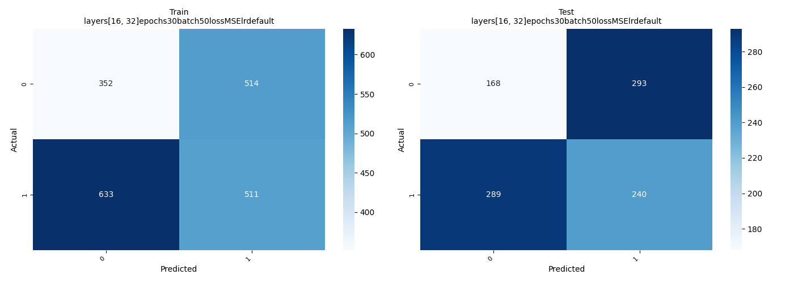

[Return to Panagiotis Bernalis' GitHub Profile for more innovative projects](https://github.com/pbernalis)

# Neural Network Model Comparison AI

This repository contains a project that explores the performance of various neural network configurations for predicting side effects based on age and weight. The project includes data generation, model creation, training, evaluation, and visualization of results.


## Table of Contents

- [Introduction](#introduction)
- [Technologies](#technologies)
  - [Anaconda](#anaconda)
  - [CUDA](#cuda)
  - [PyCharm](#pycharm)
- [Code Overview](#code-overview)
  - [Data Generation](#data-generation)
  - [Model Creation](#model-creation)
  - [Training and Evaluation](#training-and-evaluation)
  - [Visualization](#visualization)
- [Results](#results)
  - [Dataset with 1500 Samples](#dataset-with-1500-samples)
  - [Dataset with 3000 Samples](#dataset-with-3000-samples)
  - [Summary Graphs](#summary-graphs)
    - [Observations for Summary Graph (1500 Data Points)](#observations-for-summary-graph-1500-data-points)
    - [Observations for Summary Graph (3000 Data Points)](#observations-for-summary-graph-3000-data-points)
- [Graphical Analysis](#graphical-analysis)
  - [Data Set with 1500 Samples](#data-set-with-1500-samples)
  - [Data Set with 3000 Samples](#data-set-with-3000-samples)
- [Conclusion](#conclusion)
- [Comparative Analysis](#comparative-analysis)
- [Installation](#installation)
- [Logging](#logging)
- [Contact](#contact)
- [License](#license)

## Introduction

This project investigates the possibility of creating a neural network to predict if a patient will experience side effects from an experimental drug based on their age and weight. The experimental drug was tested in a clinical trial with 3000 participants, divided evenly into two age groups: under 65 and 65 and older. The results indicated that individuals aged 65 and over, as well as overweight individuals, are more likely to experience side effects.

To construct an accurate and efficient model, various neural network architectures and training settings were employed. Specifically, two scenarios were examined: one with two hidden layers and another with three. These configurations were evaluated for their performance using different loss functions, learning rates, and data volumes. The analysis and results were presented graphically using confusion matrices and comparative metrics to highlight the best approaches for this problem.


## Technologies

### Anaconda

Anaconda simplifies the setup of Python environments and package management. Key benefits include:

- **Simplified installation**: Virtual environments for isolated library installations.
- **Dependency management**: Automatic handling of library dependencies.
- **Environment reproducibility**: Easy creation and sharing of development environments.
- **Collaboration**: Facilitates sharing consistent environments with collaborators.
- **Access to numerous packages**: Large repository of Python libraries.

### CUDA

CUDA is a parallel computing platform developed by NVIDIA for GPU computing. Benefits include:

- **High performance**: Leveraging GPU's parallel processing power.
- **Accelerated machine learning**: Speeding up training and inference of models.
- **Flexibility**: Supports various programming languages.

### PyCharm

PyCharm is an integrated development environment (IDE) for Python by JetBrains. Benefits include:

- **Ease of use**: User-friendly interface and navigation.
- **Advanced code analysis**: Intelligent code completion and error detection.
- **Integrated tools**: Support for testing, debugging, and version control.

## Code Overview

### Data Generation

The `create_data` function generates synthetic data for age, weight, and side effects based on predefined rules. The data is then normalized using the `normalize_data` function.

### Model Creation

The `create_model` function builds a neural network model using the Keras Sequential API. The model architecture and training configurations are defined by the `configs` list, which includes various combinations of layers, epochs, batch sizes, loss functions, and learning rates.

### Training and Evaluation

The models are trained and evaluated using the `evaluate_results` function, which calculates accuracy, ROC AUC, and Precision-Recall AUC for both training and test sets. Confusion matrices are also computed for each model.

### Visualization

The results are visualized using the following functions:
- `plot_confusion_matrices`: Plots confusion matrices for training and test sets.
- `plot_comparative_metrics_bar`: Plots bar charts to compare various metrics across different model configurations.

## Results

### Dataset with 1500 Samples

#### Network Structure: Layers [16, 32]
1. **Learning rate: 0.01**
   - Training: Accuracy: 99.80%, ROC-AUC: 1.0, PR-AUC: 1.0
   - Testing: Accuracy: 99.79%, ROC-AUC: 1.0, PR-AUC: 1.0
2. **Learning rate: 0.0001**
   - Training: Accuracy: 90.85%, ROC-AUC: 0.98, PR-AUC: 0.98
   - Testing: Accuracy: 89.69%, ROC-AUC: 0.98, PR-AUC: 0.98
3. **Default learning rate**
   - Training: Accuracy: 99.20%, ROC-AUC: 1.0, PR-AUC: 1.0
   - Testing: Accuracy: 98.99%, ROC-AUC: 1.0, PR-AUC: 1.0

#### Network Structure: Layers [16, 32] with 30 Epochs and Batch Size 50
1. **Learning rate: 0.01**
   - Training: Accuracy: 50.25%, ROC-AUC: 0.51, PR-AUC: 0.53
   - Testing: Accuracy: 56.16%, ROC-AUC: 0.55, PR-AUC: 0.53
2. **Learning rate: 0.0001**
   - Training: Accuracy: 46.07%, ROC-AUC: 0.52, PR-AUC: 0.51
   - Testing: Accuracy: 44.65%, ROC-AUC: 0.54, PR-AUC: 0.49
3. **Default learning rate**
   - Training: Accuracy: 49.55%, ROC-AUC: 0.47, PR-AUC: 0.53
   - Testing: Accuracy: 46.66%, ROC-AUC: 0.41, PR-AUC: 0.47

#### Network Structure: Layers [16, 32, 64]
1. **Learning rate: 0.01**
   - Training: Accuracy: 99.90%, ROC-AUC: 1.0, PR-AUC: 1.0
   - Testing: Accuracy: 99.79%, ROC-AUC: 1.0, PR-AUC: 1.0
2. **Learning rate: 0.0001**
   - Training: Accuracy: 95.82%, ROC-AUC: 0.99, PR-AUC: 0.99
   - Testing: Accuracy: 95.95%, ROC-AUC: 0.99, PR-AUC: 0.99
3. **Default learning rate**
   - Training: Accuracy: 99.90%, ROC-AUC: 1.0, PR-AUC: 1.0
   - Testing: Accuracy: 100%, ROC-AUC: 1.0, PR-AUC: 1.0

### Dataset with 3000 Samples

#### Network Structure: Layers [16, 32]
1. **Learning rate: 0.01**
   - Training: Accuracy: 100%, ROC-AUC: 1.0, PR-AUC: 1.0
   - Testing: Accuracy: 100%, ROC-AUC: 1.0, PR-AUC: 1.0
2. **Learning rate: 0.0001**
   - Training: Accuracy: 94.22%, ROC-AUC: 0.99, PR-AUC: 0.99
   - Testing: Accuracy: 94.04%, ROC-AUC: 0.99, PR-AUC: 0.99
3. **Default learning rate**
   - Training: Accuracy: 98.66%, ROC-AUC: 1.0, PR-AUC: 1.0
   - Testing: Accuracy: 98.38%, ROC-AUC: 1.0, PR-AUC: 1.0

#### Network Structure: Layers [16, 32, 64]
1. **Learning rate: 0.01**
   - Training: Accuracy: 99.92%, ROC-AUC: 1.0, PR-AUC: 1.0
   - Testing: Accuracy: 99.20%, ROC-AUC: 1.0, PR-AUC: 1.0
2. **Learning rate: 0.0001**
   - Training: Accuracy: 95.82%, ROC-AUC: 0.99, PR-AUC: 0.99
   - Testing: Accuracy: 95.95%, ROC-AUC: 0.99, PR-AUC: 0.99
3. **Default learning rate**
   - Training: Accuracy: 99.90%, ROC-AUC: 1.0, PR-AUC: 1.0
   - Testing: Accuracy: 100%, ROC-AUC: 1.0, PR-AUC: 1.0

### Summary Graphs

#### Observations for Summary Graph (1500 Data Points)

- Models with layers=[16, 32, 64] and epochs=20, batch_size=10, loss_function=sparse_categorical_crossentropy show the highest training accuracy, approaching 1.0.
- Similar high accuracy observed for layers=[16, 32] with learning_rate=0.01.
- High ROC AUC values for both training and testing sets, close to 1.0.

#### Observations for Summary Graph (3000 Data Points)

- High performance consistency for layers=[16, 32, 64] and layers=[16, 32] with specified epochs, batch sizes, and loss functions.
- Stable and high performance across various metrics, confirming robust model configurations.

## Graphical Analysis

### Data Set with 1500 Samples

- Models with layers=[16, 32, 64] and epochs=20, batch_size=10, loss_function=sparse_categorical_crossentropy showed the highest training accuracy (close to 1.0).
- Similar configurations performed well on test accuracy and AUC metrics.


### Data Set with 3000 Samples

- Consistent high performance with layers=[16, 32, 64] and epochs=20, batch_size=10, learning_rate=0.01 or 0.0001.
- Sparse categorical cross-entropy was the most effective loss function.





### Conclusion

The best-performing configurations:
1. layers=[16, 32, 64], epochs=20, batch_size=10, loss_function=sparse_categorical_crossentropy, learning_rate=0.01 or 0.0001
2. layers=[16, 32], epochs=20, batch_size=10, loss_function=sparse_categorical_crossentropy, learning_rate=0.01

These configurations consistently showed high performance across all metrics in both training and test sets.

### Summary Graphs

#### Observations for Summary Graph (1500 Data Points)

The summary graph provides a comparative analysis of various neural network models based on different performance metrics. The diagrams included are:

1. **Comparison of Train Acc**: Comparing accuracy on the training set.
2. **Comparison of Test Acc**: Comparing accuracy on the test set.
3. **Comparison of ROC AUC Train**: Comparing ROC AUC on the training set.
4. **Comparison of ROC AUC Test**: Comparing ROC AUC on the test set.
5. **Comparison of PR AUC Train**: Comparing PR AUC on the training set.
6. **Comparison of PR AUC Test**: Comparing PR AUC on the test set.

By analyzing the diagrams, we can make the following observations and draw conclusions regarding the best model configuration:

**Observations:**

1. **Train Acc:**
   - Models with configurations `layers=[16, 32, 64]`, `epochs=20`, `batch_size=10`, and `loss_function=sparse_categorical_crossentropy` show the highest accuracy on the training set, reaching up to 1.0.
   - Similarly, the model with `layers=[16, 32]`, `epochs=20`, `batch_size=10`, and `learning_rate=0.01` also demonstrates high accuracy.

2. **Test Acc:**
   - The same configurations (`layers=[16, 32, 64]` with different learning rates) also exhibit high accuracy values on the test set, approximately around 0.8-0.9.
   - The model with `layers=[16, 32]`, `epochs=20`, `batch_size=10`, and `learning_rate=0.01` shows comparable performance.

3. **ROC AUC Train:**
   - Models with configurations `layers=[16, 32, 64]` again show excellent performance on the training set, with ROC AUC values close to 1.0.
   - The configuration `layers=[16, 32]`, `epochs=20`, `batch_size=10`, and `learning_rate=0.01` also shows high ROC AUC values.

4. **ROC AUC Test:**
   - These configurations maintain high ROC AUC values on the test set, with values close to 0.9.
   - Similarly, the configuration `layers=[16, 32]`, `epochs=20`, `batch_size=10`, and `learning_rate=0.01` performs exceptionally well.

5. **PR AUC Train:**
   - Configurations with `layers=[16, 32, 64]` and `layers=[16, 32]` show very good PR AUC values on the training set.

6. **PR AUC Test:**
   - The same configurations demonstrate high PR AUC values on the test set, confirming their stability.

**Conclusions:**

Based on the above observations, the best model configuration appears to be:

- **Configuration 1:**
  - `layers=[16, 32, 64]`
  - `epochs=20`
  - `batch_size=10`
  - `loss_function=sparse_categorical_crossentropy`
  - `learning_rate=0.01 or 0.0001`

- **Configuration 2:**
  - `layers=[16, 32]`
  - `epochs=20`
  - `batch_size=10`
  - `loss_function=sparse_categorical_crossentropy`
  - `learning_rate=0.01`

These configurations consistently demonstrate high performance across all metrics in both the training and test sets.


#### Observations for Summary Graph (3000 Data Points)

Comparative configurations of neural network models based on different performance metrics. The diagrams included are:

1. **Comparison of Train Acc**: Comparing accuracy on the training set.
2. **Comparison of Test Acc**: Comparing accuracy on the test set.
3. **Comparison of ROC AUC Train**: Comparing ROC AUC on the training set.
4. **Comparison of ROC AUC Test**: Comparing ROC AUC on the test set.
5. **Comparison of PR AUC Train**: Comparing PR AUC on the training set.
6. **Comparison of PR AUC Test**: Comparing PR AUC on the test set.

**Analysis, Observations, and Conclusions:**

**Observations:**

1. **Train Acc:**
   - Models with configurations `layers=[16, 32, 64]`, `epochs=20`, `batch_size=10`, and `loss_function=sparse_categorical_crossentropy` show the highest accuracy on the training set, reaching up to 1.0.
   - Similarly, the model with `layers=[16, 32]`, `epochs=20`, `batch_size=10`, and `learning_rate=0.01` also demonstrates high accuracy.

2. **Test Acc:**
   - The same configurations (`layers=[16, 32, 64]` with different learning rates) also exhibit high accuracy values on the test set, approximately around 0.8-0.9.
   - The model with `layers=[16, 32]`, `epochs=20`, `batch_size=10`, and `learning_rate=0.01` shows comparable performance.

3. **ROC AUC Train:**
   - Models with configurations `layers=[16, 32, 64]` again show excellent performance on the training set, with ROC AUC values close to 1.0.
   - The configuration `layers=[16, 32]`, `epochs=20`, `batch_size=10`, and `learning_rate=0.01` also shows high ROC AUC values.

4. **ROC AUC Test:**
   - These configurations maintain high ROC AUC values on the test set, with values close to 0.9.
   - Similarly, the configuration `layers=[16, 32]`, `epochs=20`, `batch_size=10`, and `learning_rate=0.01` performs exceptionally well.

5. **PR AUC Train:**
   - Configurations with `layers=[16, 32, 64]` and `layers=[16, 32]` show very good PR AUC values on the training set.

6. **PR AUC Test:**
   - The same configurations demonstrate high PR AUC values on the test set, confirming their stability.

**Conclusions:**

Based on the above observations, the best model configuration appears to be:

- **Configuration 1:**
  - `layers=[16, 32, 64]`
  - `epochs=20`
  - `batch_size=10`
  - `loss_function=sparse_categorical_crossentropy`
  - `learning_rate=0.01 or 0.0001`

- **Configuration 2:**
  - `layers=[16, 32]`
  - `epochs=20`
  - `batch_size=10`
  - `loss_function=sparse_categorical_crossentropy`
  - `learning_rate=0.01`

These configurations consistently demonstrate high performance across all metrics in both the training and test sets.

### Comparative Analysis

The analysis of the model configurations demonstrates the consistently high performance of the specific parameterizations mentioned previously. The configurations with `layers=[16, 32, 64]` and `layers=[16, 32]`, using the specified epochs, batch sizes, and loss functions, deliver exceptional results in metrics such as accuracy, ROC AUC, and PR AUC for both training and test sets.


## Installation

1. Clone the repository:
    ```sh
    git clone https://github.com/yourusername/neural-network-model-comparison.git
    cd neural-network-model-comparison
    ```

2. Install the required dependencies:
    ```sh
    pip install -r requirements.txt
    ```

3. Run the main script:
    ```sh
    python main.py
    ```

## Logging

The training process is logged into `training.log` file for further analysis.

## Contact

For any inquiries or access requests, please reach out via [LinkedIn](https://www.linkedin.com/in/pbernalis/) or email at [pbernalis@gmail.com](mailto:pbernalis@gmail.com).

## License

This project is licensed under the terms specified in this document. For more information, see the [LICENSE](https://github.com/pbernalis/pbernalis/blob/main/blob/main/License.md) file.
